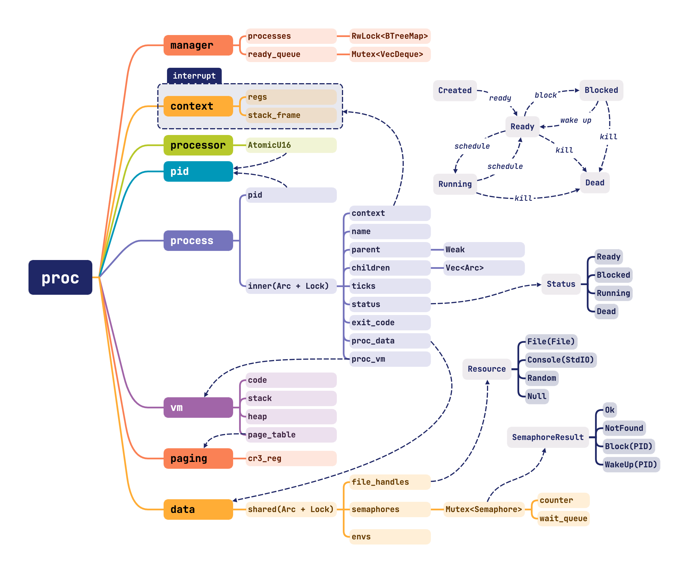

# 实验三：内核线程与缺页异常

!!! danger "在执行每一条命令前，请你对将要进行的操作进行思考"

    **为了你的数据安全和不必要的麻烦，请谨慎使用 `sudo`，并确保你了解每一条指令的含义。**

    **1. 实验文档给出的命令不需要全部执行**

    **2. 不是所有的命令都可以无条件执行**

    **3. 不要直接复制粘贴命令执行**

## 进程模型设计

在不同的操作系统中，进程模型的设计各有千秋。在 macOS xnu 和 Windows NT 内核中，线程是调度执行的基本单位，进程是资源分配的基本单位，线程通过共享进程所描述的一系列资源来互相协作。而在 Linux 内核中，没有线程的相关概念，而进程也同时是调度执行的基本单位，通过一些特殊的机制来实现进程间的协作和资源共享。有关进程模型的区别、设计在理论课上有详细的讲解，这里不再赘述。

进程的实现和调度是（抢占式）操作系统的核心，在本实验所要实现的操作系统中将采用和 Linux 设计相近的进程模型设计理念，即进程也是被调度的单位。下图是本实验的进程模型设计示意图。

**实验并不会一次将它完全实现，很多部分将在未来的实验中逐步补全，在这里希望大家能有一个整体性的理解，并在实现的过程中明确自己当前在做什么**：

!!! warning "实验须知"

    1. 本次实验为后续实验的核心基础，是个难啃的骨头！

    2. 强烈建议在进行本次实验前，先阅读完本次实验的所有文档，了解本次实验的实验内容。

    3. 推荐根据给出的思维导图，将给出的代码浏览一遍，对代码结构有一个整体性的认识。



### 进程控制块

进程控制块（Process Control Block，PCB）是操作系统中用于描述进程的一种数据结构，它包含了进程的所有信息。

在实验中使用 `Process` 结构体表示一个进程，它含有 `pid` 和 `inner` 两个字段，分别表示进程的 ID 和内部数据。`inner` 字段是一个 `Arc<RwLock<ProcessInner>>` 类型的智能指针，它指向了一个 `ProcessInner` 结构体，这个结构体包含了进程的其他信息，包括进程的状态、调度计次、退出返回值、内存空间、父子关系、中断上下文、文件描述符表等等。

??? note "`RwLock` 读写锁"

    `RwLock` 读写锁允许多个线程同时读取数据，但只允许一个线程写入数据。

    多个线程可以同时通过 `read()` 获取读锁，对数据进行读取操作，但只有一个线程可以通过 `write()` 获取写锁，对数据进行写入操作。当有线程获取写锁时，所有的读锁都会被阻塞，直到写锁被释放。

??? note "`Arc` 原子引用计数智能指针"

    `Arc` 是 `alloc::sync` 中的一个原子引用计数智能指针，它允许多个线程同时拥有对同一数据的所有权，且不会造成数据竞争。

    `Arc` 的 `clone()` 方法会增加引用计数，`drop()` 方法会减少引用计数，当引用计数为 0 时，数据会被释放。`Arc` 本身是**不可变的**，但可以通过 `RwLock` 获取内部可变性，进而安全的修改一个被多个线程所持有的数据。

进程有一个唯一标识符：`pid`，实验使用 `struct ProcessId(pub u16)` 进行实现，在最基本的实现中，只需要保证每一次 `ProcessId::new()` 调用都会返回一个不同的 `ProcessId` 即可。

对于 `ProcessInner` 结构体，在后面的实验中将逐步补全和解释它的实现。

### 进程上下文

在抢占式操作系统中，进程的调度是通过中断来实现的。当一个进程的时间片用完后，操作系统会触发一个时钟中断，进程调度器会被唤醒，它会根据进程的状态和调度策略来决定下一个要运行的进程。在调度器决定好下一个要运行的进程后，它会将当前进程的上下文保存起来，然后将下一个进程的上下文恢复，从而使得下一个进程得以运行。

在之前的实验中，已经描述过在 x86_64 架构下的中断发生时，CPU 会将当前的一部分上下文保存到内核栈中，然后跳转到中断处理函数。这些上下文包括：

- `instruction_pointer`：指令指针，保存了中断发生时 CPU 正在执行的指令的地址。
- `code_segment`：代码段寄存器，保存了当前正在执行的代码段的选择子。
- `cpu_flags`：CPU 标志寄存器，保存了中断前的 CPU 标志状态。
- `stack_pointer`：栈指针，保存了中断前的栈指针。
- `stack_segment`：栈段寄存器，保存了中断前的栈段选择子，在 x86_64 下总是为 0。

而在进行进程切换时，通常还需要保存和恢复更多的上下文，这些内容主要包括通用寄存器和浮点寄存器。为了简化实现，实验在编译架构选项中禁用了浮点寄存器，因此只需要保存和恢复通用寄存器即可。

??? question "所有通用寄存器都需要保存吗？"

    如果完全按照调用约定，并不是全部寄存器都应当在中断发生和进程切换时被保存。

    但是为了简化实现，在实验中将所有通用寄存器都保存到了进程上下文中。

在 `src/utils/regs.rs` 中，实现了寄存器的保存和恢复，并为寄存器声明了自己的结构体。

这里解释一下 `as_handler` 宏的实现：

```rust
#[macro_export]
macro_rules! as_handler {
    ($fn: ident) => {
        paste::item! {
            #[unsafe(naked)]
            pub extern "x86-interrupt" fn [<$fn _handler>](_sf: InterruptStackFrame) {
                core::arch::naked_asm!("
                push rbp
                // ...
                push r15
                call {}
                pop r15
                // ...
                pop rbp
                iretq",
                sym $fn);
            }
        }
    };
}
```

`as_handler` 宏接受一个函数名作为参数，它会生成一个函数名为 `[函数名]_handler` 的函数，中断栈本身会包含 `InterruptStackFrame` 作为参数（`x86-interrupt` 调用约定中实现），而这里需要保存更多寄存器到栈上，因此使用 `naked` 属性来禁用 Rust 的栈帧生成，然后使用汇编代码来手动保存和恢复寄存器。

在保存了寄存器后，使用 `call` 指令调用原函数，然后恢复寄存器，使用 `iretq` 指令返回。

在此宏进行转换后，使用如下的方式声明并使用一个中断处理函数：

```rust
pub unsafe fn reg_idt(idt: &mut InterruptDescriptorTable) {
    idt[/* ... */].set_handler_fn(teapot_handler);
}

pub extern "C" fn teapot(mut context: ProcessContext) {
    // do something
}

as_handler!(teapot);
```

`extern "C"` 用于指定函数使用 C 语言的调用约定，使得这一函数不会被编译器内联或使用 Rust 函数命名规范，从而能够正确导出符号参与编译器链接。

对于参数部分，`ProcessContext` 的简单声明如下：

```rust
#[repr(C)]
pub struct ProcessContext {
    value: ProcessContextValue,
}

#[repr(C)]
pub struct ProcessContextValue {
    pub regs: RegistersValue,
    pub stack_frame: InterruptStackFrameValue,
}
```

`ProcessContext` 实现了内部 `value` 的 `Deref` trait，因此可以直接使用 `ProcessContextValue` 中的字段内容。而 `ProcessContextValue` 相关的保护处理方法参考并实现自 `InterruptStackFrame` 的内部实现，用以防止意外的修改及其导致的非预期行为。

`repr(C)` 用于指定使用 C 语言的结构体布局，以便于在汇编代码中正确处理结构体的字段。

### 进程页表

进程的页表是通过向 `Cr3` 寄存器写入页表的物理地址来实现控制的，因此在进程切换时，需要将进程的页表物理地址写入 `Cr3` 寄存器。

除了内核进程的页表在启动时被初始化外，其他进程的页表都是在进程创建时被初始化的。它们通常通过克隆内核进程来实现，这样做的目的是当程序陷入中断时，CPU 能够正常访问到内核的代码和数据，从而能够正常的进行系统调用。

!!! question "如何克隆一个页表？"

    x86_64 架构下的四级页表是一个树形结构，进而能够映射到很大的虚拟地址空间，且不需要很大的内存开销。

    这里假设**页表的页面在映射后不会被修改**，且用户进程的地址空间和内核地址空间有一定的差距，一般的实现是将内核映射到很高的地址空间，而用户进程映射到较低的地址，这一点可以从 lab 1 的映射中看出。

    在这样的假设下克隆页表的过程中，就不需要将整棵页表树都复制一遍，只需要复制根节点即可。

在后续有关用户进程的实现中，还会遇到有关页表共享的问题，这里暂时不作展开。

### 进程调度

进程调度的工作目的简单来说就是从就绪队列中选取一个进程，并将其分配给选定的 CPU 核心运行。在实验中，为了实现简单，YSOS 自始至终只会使用一个 CPU 核心。

在实验中，将实现一个简单的 FIFO 调度器，它会将就绪队列中的第一个进程选出来，然后将其分配给 CPU 核心运行，当进程的时间片用完后，调度器会将其重新放回就绪队列的末尾。

在 `src/proc/processor.rs` 中，`Processor` 结构体存储了一个 `AtomicU16`，用于表示当前正在运行的进程的 PID。

在 PID 的设计中，**本实验使用 `0` 表示当前没有进程在运行**，因此在 `Processor` 结构体初始化时，将其初始化为 `0`。

为了给扩展实验的多处理器支持预留可行性，实验设计把 `Processor` 结构体放在一个静态数组之中，数组的长度为 `MAX_CPU_COUNT`：

```rust
const MAX_CPU_COUNT: usize = 8;

#[allow(clippy::declare_interior_mutable_const)]
const EMPTY: Processor = Processor::new(); // means no process

static PROCESSORS: [Processor; MAX_CPU_COUNT] = [EMPTY; MAX_CPU_COUNT];

pub struct Processor(AtomicU16);

impl Processor {
    pub const fn new() -> Self {
        Self(AtomicU16::new(0))
    }
}
```

这里使用了一个小技巧来初始化一个静态数组，`clippy` 的规则会说明 `EMPTY` 在进行复制的时候会进行内存复制，这或许不是代码作者所期望的行为（`declare_interior_mutable_const`）。

然而，这里恰好利用这一特性来绕过 `AtomicU16` 没有实现 `Copy` 的限制，将 `EMPTY` 复制到数组中的每一个元素，从而实现了这一数组的初始化。

在 `src/proc/manager.rs` 中，定义了 `ProcessManager`:

```rust
pub struct ProcessManager {
    processes: RwLock<BTreeMap<ProcessId, Arc<Process>>>,
    ready_queue: Mutex<VecDeque<ProcessId>>,
}
```

其中 `processes` 字段用于存储所有的进程，`ready_queue` 字段则用于存储就绪的进程队列。`ProcessManager` 结构体被设计为“不可变”的，也就是说，它由 `RwLock` 和 `Mutex` 来提供内部可变性。

就绪队列的操作（`push` 和 `pop`）是需要对 `VecDeque` 进行修改，所以是在 `Mutex` 的保护下进行的，并没有读写操作的区别。

而进程列表只有 `insert` 操作需要对 `BTreeMap` 的可变引用，因此 `RwLock` 的保护下更加合适。

在 `ProcessManager` 的不可变约束下，就可以通过 `spin::Once` 来定义一个全局的 `ProcessManager`，并在 `init()` 函数中初始化它：

```rust
pub static PROCESS_MANAGER: spin::Once<ProcessManager> = spin::Once::new();

pub fn init(init: Arc<Process>) {
    processor::set_pid(init.pid());
    PROCESS_MANAGER.call_once(|| ProcessManager::new(init));
}

pub fn get_process_manager() -> &'static ProcessManager {
    PROCESS_MANAGER
        .get()
        .expect("Process Manager has not been initialized")
}
```

#### 内核进程

在初始化进程管理器时，为了让内核始终和其他进程有一样的获取时间片的机会，需要将内核进程作为第一个进程加入进程列表。

之后的每次切换时，内核进程也会被视作一个普通的进程，从而被调度器选中、保存、执行。

因此，`ProcessManager` 初始化时需要传入一个 `init` 进程，它会作为内核进程加入进程列表：

```rust
pub fn new(init: Arc<Process>) -> Self {
    let mut processes = BTreeMap::new();
    let ready_queue = VecDeque::new();
    let pid = init.pid();

    trace!("Init {:#?}", init);

    processes.insert(pid, init);
    Self {
        processes: RwLock::new(processes),
        ready_queue: Mutex::new(ready_queue),
    }
}
```

在之后的代码任务中，你需要将内核状态存储为一个进程，并在初始化时将其传入。

#### 时钟中断的处理

时钟中断发生时，进程调度器被运行，CPU 通过 IDT 调用中断处理程序，完成进程的切换。

在一次进程切换的过程中，需要**关闭中断**，之后完成以下几个步骤：

- 保存当前进程的上下文

    经过上述进程上下文的描述可知，作为可变引用参数被传入的 `ProcessContext` 中存储了进程切换时需要保存的所有寄存器的值，并且其中的内容将会在进程切换完成后被恢复，进而真正实现进程的切换。

    因此，进程切换的第一步就是将 `context` 保存至当前进程的 `ProcessInner` 中，以便下次恢复运行状态。

- 更新当前进程的状态

    进程切换时，若它当前的状态并非 `Dead`，则当前进程的状态会被更新为 `Ready`。

    同时，为了记录进程的执行时间，一般也会记录进程的调度次数，这里使用 `usize` 类型的 `ticks_passed` 字段来记录进程的调度次数。

- 将当前进程放入就绪队列

    当前进程被切换出去后，它会被放入就绪队列的末尾，等待下一次调度。

    !!! tip "被调度的进程状态可能在就绪队列中时发生了改变，因此需要进行一些检查。"

- 从就绪队列中选取下一个进程

    进程调度器会从就绪队列中选取第一个进程，检查进程的状态，如果进程处于可调度状态，就将其状态更新为 `Running`，并将其 PID 写入 `Processor` 中。

- 切换进程上下文和页表

    进程调度器会将选中的进程的上下文重新加载，并将新进程的页表物理地址写入 `Cr3` 寄存器，从而完成进程的切换。

### 进程的内存布局

在开启了虚拟内存的情况下，操作系统拥有巨大的地址空间，可以赋予它们不同的功能，管理这些内存如何使用。

在已经进行过的实验中，笔者为大家预设了一些内存布局，你应该或多或少接触过这些地址：

- 物理内存偏移：`0xFFFF800000000000`

    通过定义物理内存偏移，借助 2MB 的页映射，将物理内存线性映射到了这一偏移量所对应的的地址空间中。在内核中，当需要访问一个物理内存地址，如 `0x1000` 时，就可以通过 `0xFFFF800000001000` 来访问。

- 内核空间起始地址：`0xFFFFFF0000000000`

    在操作系统中，一般会将内核地址映射到高偏移，而将用户地址映射到低偏移。在实验中，内核空间的起始地址被定义在了 `0xFFFFFF0000000000`，这相当于为内核预留了 1TiB 的地址空间。

    通过 `kernel.ld` 链接器脚本，将内核的起始地址设置为了这一地址，实验中编译的操作系统内核会被链接到从这一地址开始的地址空间中。同时，通过 bootloader 中的内核加载函数，读取 ELF 文件的描述，并将这些内容加载到了对应的地址空间中。

- 内核栈地址：`0xFFFFFF0100000000`

    内核栈的起始地址通过配置文件被定义在了 `0xFFFFFF0100000000`，距离内核起始地址 4GiB。默认大小为 512 个 4KiB 的页面，即 2MiB。

    在虚拟内存的规划中，任意进程的栈地址空间大小为 4GiB。以内核为例，内核栈所对应的内存区域的起始地址为 `0xFFFFFF0100000000`，结束地址为 `0xFFFFFF0200000000`。

    !!! note "缺页异常？"

        你可能会注意到，4GiB 的栈空间中实际映射的目前只有 2MiB，剩下的页面都是没有映射的。

        在未来的实验内容中，你将会处理这种缺页异常，并在需要时为进程进行映射。

在了解了这些虚拟地址空间预设的情况下，进一步来考虑其他进程的内存布局。本次实验中，由于还没有“用户进程”的概念，可以暂时先考虑的少一些，但是便于本次实验使用的解决方案。

在 `src/proc/vm/stack.rs` 中，定义了一些常量：

```rust
pub const PAGE_SIZE: u64 = 0x1000;

pub const STACK_MAX_PAGES: u64 = 0x100000;
pub const STACK_MAX_SIZE: u64 = STACK_MAX_PAGES * PAGE_SIZE;
```

`STACK_MAX_SIZE` 定义了每个进程栈的最大大小，这里定义为 4GiB，即 `0x100000` 个页面。

作为一个常识：栈的增长方向是向下的，即在进行 `push` 操作时，栈指针会减小。因此，栈总是从最大地址开始，向更小的地址空间“增长”。

在本次实验中，笔者带领大家做一个临时的、取巧的实现：根据进程的 PID 来为进程分配对应的栈空间。

也即，对于 PID 为 3 的进程，它的栈空间比 PID 为 2 的进程的栈空间具有 4GiB 的偏移。

```rust
pub const STACK_MAX: u64 = 0x400000000000;
```

`STACK_MAX` 定义了栈的最大地址，实验将从这一地址向下分配进程栈。

从 `0x200000000000` 开始，它可以被切分为 8192 个 4GiB 的栈空间，这对于本次实验来说已经绰绰有余。

当然，虚拟地址空间非常大，你也可以选择你自己喜欢的位置来放置栈空间。在未来的实验中，由于不同进程将会持有不同页表，因此内存分配也将会更加灵活。

在开启了 ASLR（Address space layout randomization）的内核中，栈的内存区域也是随机的，堆内存和 `mmap` 调用的结果也是随机的。这些随机性赋予了应用程序更高的安全性，不过在这里不再过多展开。

```rust
pub const STACK_START_MASK: u64 = !(STACK_MAX_SIZE - 1);

pub const STACK_DEF_PAGE: u64 = 1;
pub const STACK_DEF_SIZE: u64 = STACK_DEF_PAGE * PAGE_SIZE;

pub const STACK_INIT_BOT: u64 = STACK_MAX - STACK_DEF_SIZE;
pub const STACK_INIT_TOP: u64 = STACK_MAX - 8;
```

`STACK_START_MASK` 定义了栈空间的掩码，它在未来将被用于检查一个地址是否存在于某个被定义的栈空间中。

`STACK_DEF_PAGE` 定义了栈的默认大小，这里定义为 1 个 4KiB 的页面。

`STACK_INIT_BOT` 定义了初始化栈的底部地址，它是栈的最大地址减去默认大小。

`STACK_INIT_TOP` 定义了初始化栈的顶部地址，它是栈的最大地址减去 8，这是为了进行内存对齐，保证 `rsp` 和 `rbp` 寄存器总是 8 的倍数。

这些数据将在后续为新进程计算和分配栈空间的时候用到，只需要将它们减去一个 PID 所计算得到的偏移，就可以方便的定位到某个进程的栈空间。

总体来说，本次实验的进程栈布局预期如下：

```txt
+---------------------+ <- 0x400000000000
|     PID 1 Stack     |
+---------------------+ <- 0x3FFF00000000
|     PID 2 Stack     |
+---------------------+ <- 0x3FFE00000000
|     PID 3 Stack     |
+---------------------+ <- 0x3FFD00000000
|         ...         |
+---------------------+
```

!!! tip "**以 PID 2 为例：<br/>初始化分配的栈的页面为 `0x3FFEFFFFF000` 到 `0x3FFF00000000`（区间左闭右开）<br/>默认栈顶地址为 `0x3FFEFFFFFFF8`**"

有关于用户进程的其他部分内存布局的说明，将在下一次实验中详细讨论。

!!! note "在了解了内存布局的设计目的之后，或许你可以自己设计内存布局……"

## 合并实验代码

!!! tip "如何使用本次参考代码"

    本次给出的参考代码为**增量补充**，即在上一次实验的基础上进行修改和补充。因此，你需要将本次参考代码与上一次实验的代码进行合并。

    文件的目录与上一次实验相同，因此你可以直接将本次参考代码的 `src` 目录下的文件复制到上一次实验的目录结构下，覆盖同名文件。

    合并后的代码并不能直接运行，你需要基于合并后的代码、按照文档进行修改补充，才能逐步实现本次实验的功能。

!!! warning "项目组织说明"

    1. 本次实验中给出的均为**参考代码片段**，所有**代码内容、代码结构**均可按照需要自行调整。
    2. 部分代码的使用**需要自行补全 `lib.rs` 和 `mod.rs` 等文件**，你也可以**添加、修改任何所需函数**。
    3. 功能在逐步实现的过程中，部分未使用代码可以进行注释以通过编译检查。

在 `pkg/kernel/src/utils` 文件夹中，增量代码补充包含了如下的模块：

- `regs.rs`：对需要保存的一系列寄存器进行了封装，规定了其输出方式，补全了进程切换时需要使用的汇编代码及 `as_handler` 宏。
- `func.rs`：定义了用于测试执行的两个函数，其中 `test` 用以验证进程调度、并发的正确性，`huge_stack` 用以验证处理缺页异常的正确性。

在 `pkg/kernel/src/proc` 文件夹中，增量代码补充包含了如下的模块：

- `context.rs`：进程上下文的定义和实现，其中包含了加载、保存进程上下文的相关函数。
- `data.rs`：进程数据结构体的定义，这里存储的数据在进程被杀死后会被释放，包含了使用 `Arc` 保护的线程间共享的数据（子进程相关内容将在下次实验中使用）。
- `vm/{mod.rs,stack.rs}`：进程的虚拟内存管理，包含了栈空间的分配和释放函数，以及一些常量的定义。
- `manager.rs`：进程管理器的定义和实现，时钟中断最终会通过进程管理器来进行任务切换。
- `paging.rs`：进程页表的存储、切换所用数据，使用 `load` 函数加载进程页表到 `Cr3` 寄存器，使用 `clone` 函数来获得当前页表的副本，用于创建新进程。
- `pid.rs`：使用元组结构体将一个 `u16` 作为进程 ID，需要为 `new` 函数确保获取唯一的 PID。
- `processor.rs`：对处理器的抽象，使用 `AtomicU16` 来存储当前正在运行的进程的 PID，使用 `set_pid` 函数来设置当前进程的 PID，使用 `get_pid` 函数来获取当前进程的 PID。
- `process.rs`：进程结构体的核心实现，包含了进程的状态、调度计数、退出返回值、父子关系、中断上下文等内容，是管理进程的核心模块。

!!! warning "利用好先前实现的日志系统和调试工具，帮助定位问题和实现功能"

    本次实验是实现较为复杂、涉及操作系统核心功能的实验，因此在实现的过程中，你大概率会遇到各种各样的问题。

    **请确保你阅读了上述文档、翻阅了本次实验提供的代码、了解结构体的组织方式及成员含义后，再动手实现实验要求。**

    我们鼓励在实验报告中积极提及**你的设计思考、在实现时遇到的问题、调试流程、问题的最终解决方案**等内容。这些内容将会在评分时作为重要的参考，好的问题和实现可能会被作为加分项考察。

!!! tip "提前查阅思考题部分可能会对你的实现有所启发"

## 进程管理器的初始化

在 `src/proc/mod.rs` 中，可以看到待补全的 `init` 函数，这个函数将内核包装成进程，并将其传递给 `ProcessManager`，使其成为第一个进程。

!!! note "记得在 `src/lib.rs` 中使用 `pub mod proc` 引用进程模块，并在 `crate::init` 函数中调用 `proc::init` 函数（位于内存初始化之后、启用中断之前）"

1. 设置内核相关信息

    为了实现内核栈的自动扩容、内存统计等功能，在创建内核时需要填充内核的进程信息。

    利用定义好的内存布局、bootloader 的实现和启动配置文件的内容，将内核的信息填充到 `ProcessData` 中。

2. 创建内核结构体

    调用 `Process::new` 函数，创建内核进程，它会返回一个 `Process` 的智能指针。

    - 在上述的假设中，实验使用 `0` 表示无进程（正在运行），内核进程的 PID 应为 `1`。
    - 内核进程没有父进程，可以直接传入 `None`。
    - 内核进程的页表就是当前 `Cr3` 寄存器的内容，使用 `PageTableContext::new()` 加载。

3. 内核进程的初始化状态

    在创建后，进程将会被传递至 `manager::init()` 函数。

    在这个函数中，需要将初始化进程设置为当前唯一正在运行的进程。设置内核进程的状态为 `Running`，并将其 PID 加载至当前的 CPU 核心结构体中。

!!! warning "使用 `print_process_list` 函数来辅助调试"

    在 `src/proc/manager.rs` 中，参考代码为各位实现了 `print_process_list` 函数，用于打印进程列表、就绪队列等信息。

    **在之后的实现过程中，涉及到进程的状态变化、进程的创建、进程的销毁、进程的调度等操作时，请调用这个函数来辅助调试，这会为你节省大量的时间。**

## 进程调度的实现

修改时钟中断的内容，移除上次实验中的计数器等模块，并参考 `DOUBLE_FAULT_IST_INDEX` 的分配处理和声明，**在 TSS 中声明一块新的中断处理栈，并将它加载到时钟中断的 IDT 中**。

!!! question "为什么需要为时钟中断分配独立的栈空间？尝试回答思考题 3。"

利用 `as_handler` 宏重新定义中断处理函数，在其中调用 `crate::proc::switch` 函数，进行进程调度切换。

之后在 `src/proc/mod.rs` 中，补全 `switch` 函数的实现，利用进程管理器所提供的功能，补全 `save_current` 和 `switch_next` 函数。

**时钟中断的处理过程在上文中已经有所提及，请尝试实现处理过程。**注意以下实现要点：

1. 在合适的时机更新进程状态、并将被暂停进程的 PID 使用 `push_ready` 函数放入就绪队列。
2. `switch_next` 在未来需要处理进程阻塞和进程死亡的情况，思考如何避免副作用，使这一函数的功能仅限于“切换到下一个进程”。
3. 使用 `pause`、`resume` 等函数来构造更具有可读性的代码。
4. 你可以通过 `drop` 函数在合适的时候主动释放取得的锁。
5. 你可以通过 `print_process_list` 函数，在合适的情况下打印进程列表，或降低时钟中断的触发频率，从而便于调试。

!!! question "如何获得一个关闭中断的上下文？"

    可以使用 `without_interrupts` 函数来处理中断的开关，它接受一个闭包作为参数，这个闭包中的代码将会在关闭中断的情况下执行。

    ```rust
    x86_64::instructions::interrupts::without_interrupts(|| {
        // do something
    })
    ```

!!! success "阶段性成果"

    在成功实现进程调度后，你应当可以观察到内核进程不断被调度，并继续执行的情况。

## 进程信息的获取

!!! note "这部分的实现较为简单，同时也作为让大家熟悉代码结构的机会"

### 环境变量

你需要补全 `src/proc/mod.rs` 中的 `env` 函数，使得外部函数可以获取到当前进程的环境变量。

尝试获取当前进程的读锁，并查询 `ProcessData` 的 `env` 函数。在期望中，这一操作只需要一行代码即可完成。

### 进程返回值

在 `src/utils/mod.rs` 中，你需要补全 `wait` 函数。

你需要为 `ProcessManager` 添加相关的处理函数，使得外部函数可以获取指定进程的返回值。一个推荐的做法是使用 `Option` 来作为这一调用的结果，如果该值为 `None`，则说明进程还没有退出，如果该值为 `Some`，则说明进程已经退出，可以获取到进程的返回值。

与上述环境变量的获取不同，这部分内容在代码样例中并没有给出，你需要自行设计实现。你可以参考 `src/proc/mod.rs` 中其他函数的实现，来进行关中断、操作进程列表等操作。

这一功能的实现在未来将被用于 `wait_pid` 系统调用，从而让父进程可以等待子进程的退出，或查询其他进程的返回值等。

作为锻炼大家实现相关功能的机会，在此处不做过多的要求和描述。

## 内核线程的创建

本次实验被称做“内核线程”，其原因在于将要创建的进程并不需要对页表、权限、代码段等进行特殊的设置，它们的内存空间和内核是共享的，因此可以当作“线程”来看待。

需要注意的是，这和后续的“用户进程”、“线程的创建”等概念是不同的，本次实验所关注的核心是**创建一个可以被调度执行的最小单位**，在后续的实验中，将逐步对其他功能进行完善。

在 `src/utils/mod.rs` 中，可以看到用于测试创建内核线程的函数定义：

```rust
pub fn new_test_thread(id: &str) -> ProcessId {
    let mut proc_data = ProcessData::new();
    proc_data.set_env("id", id);

    crate::proc::spawn_kernel_thread(
        utils::func::test,
        format!("#{}_test", id),
        Some(proc_data),
    )
}
```

此函数调用了在 `src/proc/mod.rs` 中定义的 `spawn_kernel_thread` 函数。它关闭中断，之后将函数转化为地址以使其能够赋值给 `rip` 寄存器，之后将进程的信息传递给 `ProcessManager`，使其创建所需进程。

在 `src/proc/process.rs` 中，根据你的内存布局预设和当前进程的 PID，为其分配初始栈空间。

参考 bootloader 中为内核分配栈空间的代码，克隆内核页表，使用 `elf::map_range` 函数来进行新的页面的映射。完成栈分配后，将栈顶地址返回。

!!! note "获取内核的帧分配器"

    可以通过 `get_frame_alloc_for_sure` 函数来获取能够传递给 `elf::map_range` 的 `&mut impl FrameAllocator<Size4KiB>` 类型的参数：

    ```rust
    let frame_allocator = &mut *get_frame_alloc_for_sure();
    ```

在获取了栈顶地址、待执行函数的入口地址后，将它们放入初始化的进程栈帧中。你可以修改或添加函数，利用 `ProcessContext` 的 `init_stack_frame` 函数来完成这一操作。

最后，将全新创建的进程放入进程管理器和就绪队列中，使其能够被调度执行。

!!! success "阶段性成果"

    在成功实现内核线程的创建后，尝试在 `kernel_main` 中使用 `test` 命令来创建多个内核线程，它们应当被并发地调度执行。

!!! question "记录并观察一段时间内的进程执行情况，排查如下问题："

    1. 它们是否按照预期的顺序保存和恢复执行？
    2. 有没有进程插队、执行状态不正确、执行时间不平均的情况？
    3. 它们使用的栈是否符合预期？
    4. 是否有进程存在声明退出后继续执行的情况？
    5. 就绪队列中是否存在重复的进程？

## 缺页异常的处理

在操作系统进行虚拟内存管理的时候经常会遇到缺页中断，作为可恢复的异常，它发生的可能性有很多：

- 内存页被标记为懒分配，只有当进程访问到这一页面时才会被分配。
- 部分可执行的代码段尚未被加载到内存中，需要从磁盘文件进行加载。
- 内存被交换到了磁盘上，再次使用需要交换回来。
- 内存页面被标记为只读，在进程尝试写页面的时候触发了 COW（Copy on Write）机制，需要进行页面的复制。
- 进程访问量权限不允许的内存区域，比如用户态进程尝试访问内核空间的内存。
- ……

在本实验设计中，并不会完全的实现上述的所有功能，只实现一个功能来作为缺页异常处理的示例：**为栈空间进行自动扩容。**

之前的内容中，提及了有关内存布局的相关设定，在本实验的 OS 中，每一个进程的栈空间最大为 4GiB。在初始化时，从栈顶（此进程具有的 4 GiB 的最大位置）开始，向下分配了 4 KiB 的栈空间。当进程使用的栈一直增长，直到超过了 4 KiB 的栈空间时，就会触发缺页异常。

!!! note "栈导致的缺页异常"

    在栈缺页导致的异常被触发的时候，当前访问的地址常常会与原来的栈有着**不止一个页面的差距**。

    这是因为对于一个栈需求很大的函数执行时，`rsp` 寄存器的值被直接减去了很大的值，并且为了访问栈上的变量，一些很大的偏移也会在接下来的访存中被使用。

    因此，虽然栈是逐渐增长的，但处理栈扩容时，仅仅对当前触发缺页异常的页面进行分配是不够的，为了防止过多的缺页异常，需要一次性为栈分配更多的页面。

在触发缺页异常时，尝试访问的地址会被保存在 `Cr2` 寄存器中，同时缺页异常的错误码也会随着中断栈一起传递给中断函数。

首先，在 `src/interrupt/exception.rs` 中，重新定义缺页异常的处理函数：

```rust
pub extern "x86-interrupt" fn page_fault_handler(
    stack_frame: InterruptStackFrame,
    err_code: PageFaultErrorCode,
) {
    if !crate::proc::handle_page_fault(Cr2::read(), err_code) {
        warn!(
            "EXCEPTION: PAGE FAULT, ERROR_CODE: {:?}\n\nTrying to access: {:#x}\n{:#?}",
            err_code,
            Cr2::read(),
            stack_frame
        );
        // FIXME: print info about which process causes page fault?
        panic!("Cannot handle page fault!");
    }
}
```

之后，你需要完善缺页异常的相关处理函数：

1. 在 `ProcessManager` 中，检查缺页异常是否包含越权访问或其他非预期的错误码。

2. 如果缺页异常是由于非预期异常导致的，或者缺页异常的地址不在当前进程的栈空间中，直接返回 `false`。

3. 如果缺页异常的地址在当前进程的栈空间中，把缺页异常的处理委托给当前的进程。

    你可能需要为 `ProcessInner` 和 `ProcessVm` 添加用于分配新的栈、更新进程存储信息的函数。

4. 在进程的缺页异常处理函数中：

    分配新的页面、更新页表、更新进程数据中的栈信息。

!!! note "关于页面的记录与处理"

    - 你可以使用 `Page::<Size4KiB>::containing_address(addr)` 来获取一个地址所在的页面。
    - `PageRange` 结构体是**前闭后开**的，即 `start..end` 表示的是 `[start, end)` 的页面范围。你可以访问其 `start` 和 `end` 字段来获取页面范围的起始和结束页。
    - 页面 `Page` 之间可以进行减运算，它们的结果是 `u64`，表示两个页面之间的页面数量。
    - 使用 `PageTableContext` 的 `mapper()` 函数获取 `map_range` 函数所需的 `page_table` 参数。
    - 越权访问可以使用 `PageFaultErrorCode::PROTECTION_VIOLATION` 访问对应标志位。

## 进程的退出

在正常的操作系统中，进程的退出通常是由一个系统调用实现的。

系统调用也会和时钟中断类似地保存进程的上下文，之后调用内核中的函数，完成进程的退出和切换，因此可以很好的确保进程不会再次被调度。

但是目前我们没有实现系统调用，内核线程的退出是它主动调用内核的 `process_exit` 来实现的，这样的函数调用没有进程上下文的存储和恢复过程，因此需要进行一些额外的处理，并等待下一次的时钟中断来完成进程的切换。

总体来说，实现进程的退出要完成如下几件事：

1. 在进程退出时，将进程的状态设置为 `Dead`，并删除进程运行时需要的部分数据，如 `ProcessData`。

2. 确保进程不会被再次调度，这可以在切换时添加检查、防止进程再次进入就绪队列来实现。

3. 存储进程的返回值，以便其他进程可以利用它来查询进程的退出状态。

!!! success "阶段性成果"

    在成功实现缺页异常的处理后，尝试在 `kernel_main` 中使用 `stack` 命令来创建一个栈使用很大的内核线程，而它应当被正确地处理，不会导致进程的崩溃。

    同时，此命令应该能够等待这一进程结束运行后，再进行下一步的操作。

## 思考题

1. 为什么在初始化进程管理器时需要将它置为正在运行的状态？能否通过将它置为就绪状态并放入就绪队列来实现？这样的实现可能会遇到什么问题？

2. 在 `src/proc/process.rs` 中，有两次实现 `Deref` 和一次实现 `DerefMut` 的代码，它们分别是为了什么？使用这种方式提供了什么便利？

3. 中断的处理过程默认是不切换栈的，即在中断发生前的栈上继续处理中断过程，为什么在处理**缺页异常和时钟中断**时需要切换栈？如果不为它们切换栈会分别带来哪些问题？请假设具体的场景、或通过实际尝试进行回答。
