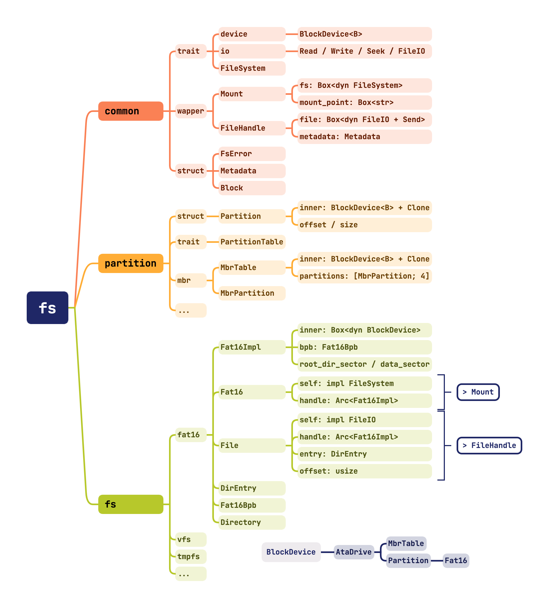

# 实验六：硬盘驱动与文件系统

!!! danger "在执行每一条命令前，请你对将要进行的操作进行思考"

    **为了你的数据安全和不必要的麻烦，请谨慎使用 `sudo`，并确保你了解每一条指令的含义。**

    **1. 实验文档给出的命令不需要全部执行**

    **2. 不是所有的命令都可以无条件执行**

    **3. 不要直接复制粘贴命令执行**

## 合并实验代码

!!! tip "如何使用本次参考代码"

    本次给出的参考代码为**增量补充**，即在上一次实验的基础上进行修改和补充。因此，你需要将本次参考代码与上一次实验的代码进行合并。

    合并后的代码并不能直接运行，你需要基于合并后的代码、按照文档进行修改补充，才能逐步实现本次实验的功能。

本次实验中提供的代码量较大，但主要部分是类型抽象和相关定义，基本没有函数逻辑，因此不要求理解后开始实验任务，用到某些类型的时候转至定义查询即可。



在所给出的代码中，主要需要补全的内容存放在 `pkg/kernel/src/drivers/ata/bus.rs` 和 `pkg/storage/src/fs/fat16/impls.rs` 中，对应任务为 ATA 磁盘驱动和 FAT 16 文件系统。

在 `pkg/storage/src/common` 中，提供了众多有关存储的底层结构：

- `block.rs`: 提供了数据块的抽象，用于存储数据，内部为指定大小的 `u8` 数组。
- `device.rs`: 目前只提供了块设备的抽象，提供分块读取数据的接口。
- `error.rs`: 定义了文件系统、磁盘、文件名可能遇到的一系列错误，并定义了以 `FsError` 为错误类型的 `Result`。
- `filesystem.rs`: 定义了文件系统的抽象，提供了文件系统的基本操作接口。
- `io.rs`: 定义了 `Read`、`Write` 和 `Seek` 的行为，不过在本次实验中只需要实现 `Read`。
- `metadata.rs`：定义了统一的文件元信息，包含文件名、修改时间、大小等信息。

同时，有了接口定义了统一的行为之后，可以利用他们来实现具有更丰富功能的结构体：

- `filehandle.rs`: 定义了文件句柄，它持有一个实现了 `FileIO` trait 的字段，并维护了文件的元数据。
- `mount.rs`: 定义了挂载点，它持有一个实现了 `Filesystem` trait 的字段，并维护了一个固定的挂载点路径，它会将挂载点路径下的文件操作请求转发给内部的文件系统。

在 `pkg/storage/src/partition/mod.rs` 中，定义了 `Partition` 结构体，和 `PartitionTable` trait，用于统一块设备的分区表行为。

在其他目录下，是需要同学们实现的 MBR 分区表和 FAT 16 文件系统。

在 `pkg/kernel/src/drivers/ata` 中，定义了 ATA 磁盘驱动的相关结构体和接口。

在 `pkg/kernel/src/drivers/filesystem` 中，定义了根文件系统的挂载和初始化等操作。

!!! warning "实验说明"

    作为一套相对独立的模块，存储结构、文件系统相关的内容可以被单独作为一个库进行编译实现。这样方便进行代码复用，并且赋予了对其进行独立测试的能力。

    同时，本次实验专注于实现**文件系统的只读操作**，重点是如何正确解析一个现实存在的文件系统，从而赋予内核直接从磁盘读取文件的能力。

    而文件系统的设计、写入、组织的内容，留作 Lab 8 中的扩展实验进行。

## MBR 分区表

作为熟悉代码结构的起步内容，我们先来实现 MBR 分区表的解析。

MBR（Master Boot Record）是一种磁盘分区表的标准，它位于磁盘的第一个扇区，占用 512 字节。在 MBR 中，有 4 个主分区表项，每个占用 16 字节，用于描述磁盘的分区信息。

之所以称为 “Boot Record”，是因为在 MBR 的定义中中还包含了引导程序的代码，在 Legacy BIOS 系统中，计算机会首先加载 MBR 中的引导程序，然后由引导程序加载操作系统。本实验使用 UEFI 进行引导工作，实际上并不会使用 MBR 中的引导程序。

MBR 分区表的结构如下，可以参考 [MBR - OSDev](https://osdev.org/MBR) 和 [Master Boot Record - wikipedia](https://en.wikipedia.org/wiki/Master_boot_record)：

<table border="2" cellpadding="4" cellspacing="0" class="wikitable"><tbody><tr><th> Offset</th><th> Size (bytes)</th><th> Description</th></tr><tr><td> 0x000</td><td> 440</td><td> MBR <b>Bootstrap</b> (flat binary executable code)</td></tr><tr><td> 0x1B8</td><td> 4</td><td> Optional "Unique Disk ID / Signature"</td></tr><tr><td> 0x1BC</td><td> 2</td><td> Optional, reserved 0x0000</td></tr><tr><td> 0x1BE</td><td> 16</td><td> First partition table entry</td></tr><tr><td> 0x1CE</td><td> 16</td><td> Second partition table entry</td></tr><tr><td> 0x1DE</td><td> 16</td><td> Third partition table entry</td></tr><tr><td> 0x1EE</td><td> 16</td><td> Fourth partition table entry</td></tr><tr><td> 0x1FE</td><td> 2</td><td> (0x55, 0xAA) "Valid bootsector" signature bytes</td></tr></tbody></table>

其中，每个分区表项的结构如下，可以参考 [wikipedia](https://en.wikipedia.org/wiki/Master_boot_record#PTE) 获取更详细的定义：

<table border="2" cellpadding="4" cellspacing="0" class="wikitable"><tbody><tr><th>Offset</th><th>Size (bytes)</th><th>Description</th></tr><tr><td>0x00</td><td>1</td><td>Status (bit 7 set = active or bootable)</td></tr><tr><td>0x01</td><td>3</td><td>CHS Address of partition start</td></tr><tr><td>0x04</td><td>1</td><td>Partition type</td></tr><tr><td>0x05</td><td>3</td><td>CHS address of last partition sector</td></tr><tr><td>0x08</td><td>4</td><td>LBA of partition start</td></tr><tr><td>0x0C</td><td>4</td><td>Number of sectors in partition</td></tr></tbody></table>

在分区表的解析实现中，只需要关心分区表项的解析，不需要关心其他的字段。因此，需要你在 `partition/mbr/mod.rs` 的 `parse` 函数中，根据 MBR 的结构定义，按照对应的偏移量，提取四个 `MbrPartition` 并进行存储。

对于分区表项，需要你在 `partition/mbr/entry.rs` 中，补全对应的结构体定义。

笔者为大家提供了一个便捷的宏：`define_field`，它的定义可以在 `common/macros.rs` 中找到，并且为各位补有文档注释，以做说明如何使用。

同时，这里以 `MbrPartition` 的定义为例子，再做一些解释：

```rust
impl MbrPartition {
    // ...
    define_field!(u8, 0x00, status);
    // ...
}
```

这里的 `define_field!` 宏，接受三个参数，分别是字段的类型、字段的偏移量和字段的名称。它会自动为你生成一个 `status()` 的函数，用于获取字段的值。

字段的类型可以是 `u8`、`u16`、`u32`，分别对应 1、2、4 字节的整数；同时还有 `[u8; n]` 的类型，用于表示固定长度的字节数组，同时也会提供一个对应的从 `&[u8]` 转换为 `&str` 的函数。

你可以在下方的 `Debug` trait 的实现中看到这些函数的使用，你需要补全其中展示的全部函数，并尝试通过文件附带的单元测试。

对于 `0x01-0x03` 和 `0x05-0x07` 两组三字节的内容分别表示了开始和结束的 CHS 地址，包含三组内容：磁头号、扇区号和柱面号，分别占用 8、6 和 10 比特，因此无法使用 `define_field` 进行简单定义，需要你自行实现 `head`、`sector` 和 `cylinder` 所对应的函数，对 `data` 进行解析。

对于后续的磁盘访问，更多通过 LBA 字段进行寻址，实际上并不会用到 CHS 的相关内容。

!!! tip "运行单元测试"

    在 Lab 0 中已经简单设计了如何运行单元测试。你可以在 `partition/mbr/entry.rs` 中找到 `tests` 模块，其中包含了测试用例，你可以通过 `cargo test` 来运行它们。

    为了能够单独运行 `mbr` 模块的测试，你可以先注释掉 `lib.rs` 中对其他模块的引用，并处理在 `partition` 中相关需要补全的代码。

    如果想要在测试时看到测试输出，可以使用 `cargo test -- --nocapture` 运行测试，需要注意的是，你应当在 `pkg/storage` 目录下执行，或使用 `--package ysos_storage` 参数指定包名。

## 磁盘驱动

在实现了 MBR 分区表解析后，笔者预计你对现有的代码结构已经有了一定的认知。现在，我们来实现 ATA 磁盘驱动，使得内核能够通过它访问“真实”的虚拟磁盘，并读取并解析其中的数据。

为了在内核中使用 `storage` 包的内容，需要对 `Cargo.toml` 进行修改，添加引用：

```toml
[dependencies]
storage = { package = "ysos_storage", path = "../storage" }
```

!!! note "明确概念：实验将实现 PATA 的 PIO 模式驱动，参考 [ATA PIO Mode - OSDev](https://wiki.osdev.org/ATA_PIO_Mode)"

回顾一下之前编写串口驱动的过程，它与即将实现的驱动类似，都是 PIO 来进行数据传输：

- 根据规范定义端口，使用端口进行读写操作控制外设寄存器
- 按照规定修改外设寄存器，使得设备按照预期的方式运行
- 通过数据和状态寄存器，实现数据的发送和接收
- 通过启用设备的中断，实现异步的数据传输（与轮询方式相对）

在 [ATA 硬盘简介](../../wiki/ata.md) 中，介绍了 ATA 硬盘的基本工作原理，以及相关概念。

在 `kernel/src/drivers/ata/bus.rs` 中，定义了 `AtaBus` 结构体，它扮演了实际与 CPU 进行数据交换的角色，而在 `mod.rs` 中定义的 `AtaDrive` 则扮演了磁盘的抽象。

这种设计类似于过往的实现中将 `serial` 与 `uart16550` 分开，不过磁盘会有自己的 `model` 等信息，需要获取并存储在 `AtaDrive` 中。

### 发送命令

为了与磁盘进行交互，需要向磁盘发送命令，在 `drivers/ata/consts.rs` 中，定义了 `AtaCommand` 枚举，它表示了一系列的命令。

在本实验中，你需要实现 28-bit 模式下的 LBA 读写命令，并且还会使用到 `IdentifyDevice` 命令，用于获取磁盘的信息。

上述三个命令的调用过程比较类似，因此可以把发送命令并等待设备就绪的过程封装为一个函数，它被定义在 `drivers/ata/bus.rs` 中，可以参考 [x86 28-bit PIO - OSDev](https://wiki.osdev.org/ATA_PIO_Mode#28_bit_PIO) 的内容，这里给出发送命令的过程：

1. 将当前块的 LBA 偏移分别存入四个寄存器中
2. 同时使用 `drive` 寄存器选择磁盘
3. 发送命令
4. 等待设备就绪，判断是否出错
5. 等待数据请求就绪

28-bit 的 LBA 地址应当按照如下方式存入寄存器，最高四位被放置在 `drive` 寄存器的低四位：

<table class="inst">
<tr>
    <td class="inst-numnodel">28</td>
    <td class="inst-numnode" colspan="2"></td>
    <td class="inst-numnoder">24</td>
    <td class="inst-numnode" colspan="6"></td>
    <td class="inst-numnoder">16</td>
    <td class="inst-numnode" colspan="6"></td>
    <td class="inst-numnoder">8</td>
    <td class="inst-numnode" colspan="6"></td>
    <td class="inst-numnoder">0</td>
</tr>
<tr>
    <td colspan="4" class="inst-node-little">drive</td>
    <td colspan="7" class="inst-node-little">lba_high</td>
    <td colspan="7" class="inst-node-little">lba_mid</td>
    <td colspan="7" class="inst-node-little">lba_low</td>
</tr>
</table>

而 `drive` 寄存器的高四位则用来进行磁盘及寻址方式的选择，具体定义如下：

<table border="2" cellpadding="4" cellspacing="0" class="wikitable"><tbody><tr><th> Bit</th><th> Abbreviation</th><th> Function</th></tr><tr><td> 0 - 3</td><td></td><td> In CHS addressing, bits 0 to 3 of the head. In LBA addressing, bits 24 to 27 of the block number.</td></tr><tr><td> 4</td><td> DRV</td><td> Selects the drive number.</td></tr><tr><td> 5</td><td> 1</td><td> Always set.</td></tr><tr><td> 6</td><td> LBA</td><td> Uses CHS addressing if clear or LBA addressing if set.</td></tr><tr><td> 7</td><td> 1</td><td> Always set.</td></tr></tbody></table>

### 磁盘识别

在完成命令发送部分后，尝试补全 `identify_drive` 函数。可以直接调用上文实现好的 `write_command` 函数，根据规范，`block` 参数使用 `0` 进行传递。

对于识别出的磁盘，会带有一个 512 字节的数据块，你需要根据 ATA 规范中的定义，参考 [IDE - OSDev](https://wiki.osdev.org/IDE)，将这些数据解析为 `AtaDrive` 的相关信息，这里给出部分会用于补全 `drivers/ata/mod.rs` 的信息。

```cpp
#define ATA_IDENT_SERIAL       20   // 20 bytes
#define ATA_IDENT_MODEL        54   // 40 bytes
#define ATA_IDENT_MAX_LBA      120  // 4 bytes (unsigned int)
```

!!! success "阶段性成果"

    在完成命令发送，并按照注释补全 `identify_drive` 函数后，你可以自行修改相关函数，测试 `AtaDrive` 的 `open` 函数。

    在操作系统初始化结束后，使用 `AtaDrive::open(0, 0)` 获取磁盘信息，为了确保通过编译，可以先忽略 `filesystem.rs`。

    如果顺利，你应该会看到 `Drive QEMU HARDDISK QM00001 (504 MiB) opened` 的日志字样。

### 读写数据

在编写 `write_command` 函数时，你或许会注意到 `sector_count` 寄存器直接被设置为了 1。

虽然 ATA 驱动支持一次读取多个扇区，但从抽象和实现角度，本实验还是采取了每次写指令只读一块的方式。由于 ATA 本身的速度就很慢，并且作为实验实现，这样能够更加灵活和便捷。

经过上述函数的统一，读写磁盘的操作变得十分简单：在使用 `write_command` 指明需要进行的操作后，从 `data` 寄存器中每次 16 位地与 `buf` 进行数据交互。

!!! tip "注意数据的端序"

在为 `Bus` 实现了 `read_pio` 和 `write_pio` 之后，你还需要在 `drivers/ata/mod.rs` 中补全块设备的实现。

`AtaDrive` 通过 `bus` 和 `drive` 字段存储了对应的磁盘信息，`BUSES` 的定义已经为大家定义完善，你需要借助这些内容，补全 `impl BlockDevice for AtaDrive` 中对应的 `FIXME` 的内容。

!!! success "阶段性成果"

    在为 `AtaDrive` 实现了块设备的 trait 后，尝试使用 `MbrTable::parse(drive)` 解析磁盘分区表。

    如果顺利，你应当能够正确获取首个分区的相关信息，包括其类型、起始 LBA 和大小。尝试添加日志来记录这些信息，并补充在报告中。

## FAT16 文件系统

!!! warning "阅读提示"

    请认真阅读 [FAT 文件系统](../../wiki/fat.md) 的内容，它将帮助你更好地理解 FAT 文件系统的结构和实现。

### BPB

在 `pkg/storage/src/fs/fat16/mod.rs` 中，定义了 `Fat16Impl` 结构体，它是 FAT16 文件系统的抽象。

## 思考题

1. 为什么在 `pkg/storage/lib.rs` 中声明了 `#![cfg_attr(not(test), no_std)]`，它有什么作用？哪些因素导致了 `kernel` 中进行单元测试是一个相对困难的事情？

2. 留意 `MbrTable` 的类型声明，为什么需要泛型参数 `T` 满足 `BlockDevice<B> + Clone`？为什么需要 `PhantomData<B>` 作为 `MbrTable` 的成员？在 `PartitionTable` trait 中，为什么需要 `Self: Sized` 约束？

3. `AtaDrive` 为了实现 `MbrTable`，如何保证了自身可以实现 `Clone`？对于分离 `AtaBus` 和 `AtaDrive` 的实现，你认为这样的设计有什么好处？

## 加分项
