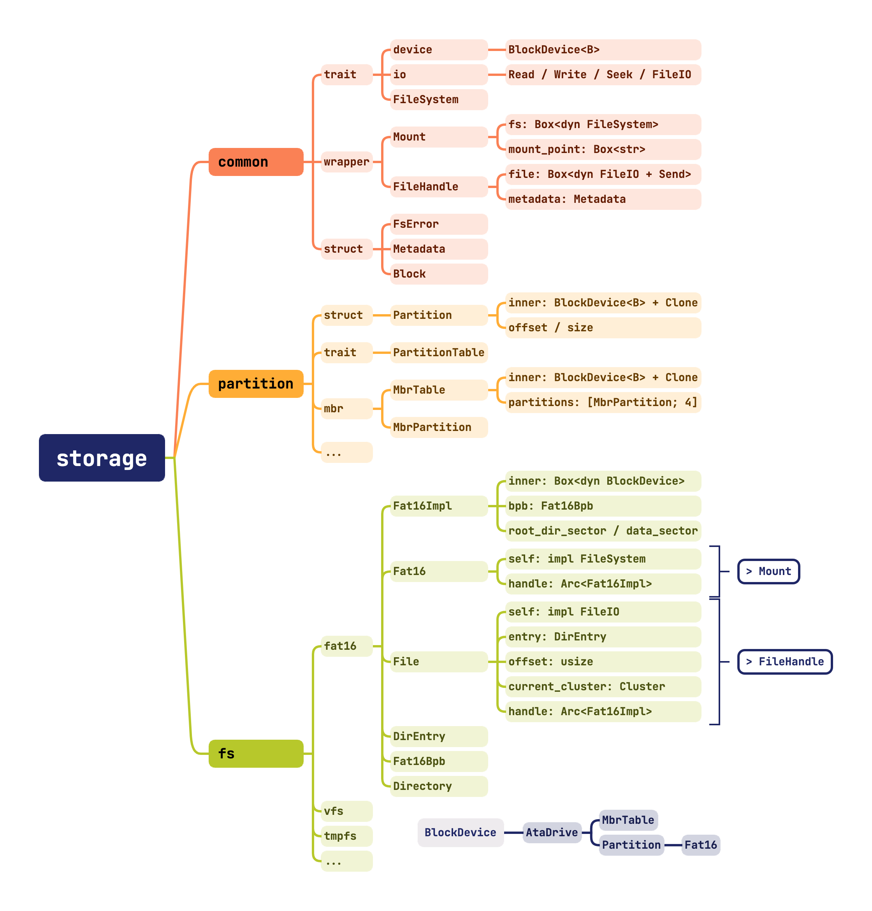

# 实验六：硬盘驱动与文件系统

!!! danger "在执行每一条命令前，请你对将要进行的操作进行思考"

    **为了你的数据安全和不必要的麻烦，请谨慎使用 `sudo`，并确保你了解每一条指令的含义。**

    **1. 实验文档给出的命令不需要全部执行**

    **2. 不是所有的命令都可以无条件执行**

    **3. 不要直接复制粘贴命令执行**

## 合并实验代码

!!! tip "如何使用本次参考代码"

    本次给出的参考代码为**增量补充**，即在上一次实验的基础上进行修改和补充。因此，你需要将本次参考代码与上一次实验的代码进行合并。

    合并后的代码并不能直接运行，你需要基于合并后的代码、按照文档进行修改补充，才能逐步实现本次实验的功能。

本次实验中提供的代码量较大，但主要部分是类型抽象和相关定义，基本没有函数逻辑，因此不要求理解后开始实验任务，用到某些类型的时候转至定义查询即可。



在所给出的代码中，主要需要补全的内容存放在 `pkg/kernel/src/drivers/ata/bus.rs` 和 `pkg/storage/src/fs/fat16/impls.rs` 中，对应任务为 ATA 磁盘驱动和 FAT 16 文件系统。

在 `pkg/storage/src/common` 中，提供了众多有关存储的底层结构：

- `block.rs`: 提供了数据块的抽象，用于存储数据，内部为指定大小的 `u8` 数组。
- `device.rs`: 目前只提供了块设备的抽象，提供分块读取数据的接口。
- `error.rs`: 定义了文件系统、磁盘、文件名可能遇到的一系列错误，并定义了以 `FsError` 为错误类型的 `Result`。
- `filesystem.rs`: 定义了文件系统的抽象，提供了文件系统的基本操作接口。
- `io.rs`: 定义了 `Read`、`Write` 和 `Seek` 的行为，不过在本次实验中只需要实现 `Read`。
- `metadata.rs`：定义了统一的文件元信息，包含文件名、修改时间、大小等信息。

同时，有了接口定义了统一的行为之后，可以利用他们来实现具有更丰富功能的结构体：

- `filehandle.rs`: 定义了文件句柄，它持有一个实现了 `FileIO` trait 的字段，并维护了文件的元数据。
- `mount.rs`: 定义了挂载点，它持有一个实现了 `Filesystem` trait 的字段，并维护了一个固定的挂载点路径，它会将挂载点路径下的文件操作请求转发给内部的文件系统。

在 `pkg/storage/src/partition/mod.rs` 中，定义了 `Partition` 结构体，和 `PartitionTable` trait，用于统一块设备的分区表行为。

在其他目录下，是需要同学们实现的 MBR 分区表和 FAT 16 文件系统。

在 `pkg/kernel/src/drivers/ata` 中，定义了 ATA 磁盘驱动的相关结构体和接口。

在 `pkg/kernel/src/drivers/filesystem` 中，定义了根文件系统的挂载和初始化等操作。

!!! warning "实验说明"

    作为一套相对独立的模块，存储结构、文件系统相关的内容可以被单独作为一个库进行编译实现。这样方便进行代码复用，并且赋予了对其进行独立测试的能力。

    同时，本次实验专注于实现**文件系统的只读操作**，重点是如何正确解析一个现实存在的文件系统，从而赋予内核直接从磁盘读取文件的能力。

    而文件系统的设计、写入、组织的内容，留作 Lab 8 中的扩展实验进行。

## MBR 分区表

作为熟悉代码结构的起步内容，我们先来实现 MBR 分区表的解析。

MBR（Master Boot Record）是一种磁盘分区表的标准，它位于磁盘的第一个扇区，占用 512 字节。在 MBR 中，有 4 个主分区表项，每个占用 16 字节，用于描述磁盘的分区信息。

之所以称为 “Boot Record”，是因为在 MBR 的定义中中还包含了引导程序的代码，在 Legacy BIOS 系统中，计算机会首先加载 MBR 中的引导程序，然后由引导程序加载操作系统。本实验使用 UEFI 进行引导工作，实际上并不会使用 MBR 中的引导程序。

MBR 分区表的结构如下，可以参考 [MBR - OSDev](https://osdev.org/MBR) 和 [Master Boot Record - wikipedia](https://en.wikipedia.org/wiki/Master_boot_record)：

<table border="2" cellpadding="4" cellspacing="0" class="wikitable"><tbody><tr><th> Offset</th><th> Size (bytes)</th><th> Description</th></tr><tr><td> 0x000</td><td> 440</td><td> MBR <b>Bootstrap</b> (flat binary executable code)</td></tr><tr><td> 0x1B8</td><td> 4</td><td> Optional "Unique Disk ID / Signature"</td></tr><tr><td> 0x1BC</td><td> 2</td><td> Optional, reserved 0x0000</td></tr><tr><td> 0x1BE</td><td> 16</td><td> First partition table entry</td></tr><tr><td> 0x1CE</td><td> 16</td><td> Second partition table entry</td></tr><tr><td> 0x1DE</td><td> 16</td><td> Third partition table entry</td></tr><tr><td> 0x1EE</td><td> 16</td><td> Fourth partition table entry</td></tr><tr><td> 0x1FE</td><td> 2</td><td> (0x55, 0xAA) "Valid bootsector" signature bytes</td></tr></tbody></table>

其中，每个分区表项的结构如下，可以参考 [wikipedia](https://en.wikipedia.org/wiki/Master_boot_record#PTE) 获取更详细的定义：

<table border="2" cellpadding="4" cellspacing="0" class="wikitable"><tbody><tr><th>Offset</th><th>Size (bytes)</th><th>Description</th></tr><tr><td>0x00</td><td>1</td><td>Status (bit 7 set = active or bootable)</td></tr><tr><td>0x01</td><td>3</td><td>CHS Address of partition start</td></tr><tr><td>0x04</td><td>1</td><td>Partition type</td></tr><tr><td>0x05</td><td>3</td><td>CHS address of last partition sector</td></tr><tr><td>0x08</td><td>4</td><td>LBA of partition start</td></tr><tr><td>0x0C</td><td>4</td><td>Number of sectors in partition</td></tr></tbody></table>

在分区表的解析实现中，只需要关心分区表项的解析，不需要关心其他的字段。因此，需要你在 `partition/mbr/mod.rs` 的 `parse` 函数中，根据 MBR 的结构定义，按照对应的偏移量，提取四个 `MbrPartition` 并进行存储。

对于分区表项，需要你在 `partition/mbr/entry.rs` 中，补全对应的结构体定义。

笔者为大家提供了一个便捷的宏：`define_field`，它的定义可以在 `common/macros.rs` 中找到，并且为各位补有文档注释，以做说明如何使用。

同时，这里以 `MbrPartition` 的定义为例子，再做一些解释：

```rust
impl MbrPartition {
    // ...
    define_field!(u8, 0x00, status);
    // ...
}
```

这里的 `define_field!` 宏，接受三个参数，分别是字段的类型、字段的偏移量和字段的名称。它会自动为你生成一个 `status()` 的函数，用于获取字段的值。

字段的类型可以是 `u8`、`u16`、`u32`，分别对应 1、2、4 字节的整数；同时还有 `[u8; n]` 的类型，用于表示固定长度的字节数组，同时也会提供一个对应的从 `&[u8]` 转换为 `&str` 的函数。

你可以在下方的 `Debug` trait 的实现中看到这些函数的使用，你需要补全其中展示的全部函数，并尝试通过文件附带的单元测试。

对于 `0x01-0x03` 和 `0x05-0x07` 两组三字节的内容分别表示了开始和结束的 CHS 地址，包含三组内容：磁头号、扇区号和柱面号，分别占用 8、6 和 10 比特，因此无法使用 `define_field` 进行简单定义，需要你自行实现 `head`、`sector` 和 `cylinder` 所对应的函数，对 `data` 进行解析。

对于后续的磁盘访问，更多通过 LBA 字段进行寻址，实际上并不会用到 CHS 的相关内容。

!!! tip "运行单元测试"

    在 Lab 0 中已经简单设计了如何运行单元测试。你可以在 `partition/mbr/entry.rs` 中找到 `tests` 模块，其中包含了测试用例，你可以通过 `cargo test` 来运行它们。

    为了能够单独运行 `mbr` 模块的测试，你可以先注释掉 `lib.rs` 中对其他模块的引用，并处理在 `partition` 中相关需要补全的代码。

    如果想要在测试时看到测试输出，可以使用 `cargo test -- --nocapture` 运行测试，需要注意的是，你应当在 `pkg/storage` 目录下执行，或使用 `--package ysos_storage` 参数指定包名。

## 磁盘驱动

在实现了 MBR 分区表解析后，笔者预计你对现有的代码结构已经有了一定的认知。现在，我们来实现 ATA 磁盘驱动，使得内核能够通过它访问“真实”的虚拟磁盘，并读取并解析其中的数据。

为了在内核中使用 `storage` 包的内容，需要对 `Cargo.toml` 进行修改，添加引用：

```toml
[dependencies]
storage = { package = "ysos_storage", path = "../storage" }
```

!!! note "明确概念：实验将实现 PATA 的 PIO 模式驱动，参考 [ATA PIO Mode - OSDev](https://wiki.osdev.org/ATA_PIO_Mode)"

回顾一下之前编写串口驱动的过程，它与即将实现的驱动类似，都是 PIO 来进行数据传输：

- 根据规范定义端口，使用端口进行读写操作控制外设寄存器
- 按照规定修改外设寄存器，使得设备按照预期的方式运行
- 通过数据和状态寄存器，实现数据的发送和接收
- 通过启用设备的中断，实现异步的数据传输（与轮询方式相对）

在 [ATA 硬盘简介](../../wiki/ata.md) 中，介绍了 ATA 硬盘的基本工作原理，以及相关概念。

在 `kernel/src/drivers/ata/bus.rs` 中，定义了 `AtaBus` 结构体，它扮演了实际与 CPU 进行数据交换的角色，而在 `mod.rs` 中定义的 `AtaDrive` 则扮演了磁盘的抽象。

这种设计类似于过往的实现中将 `serial` 与 `uart16550` 分开，不过磁盘会有自己的 `model` 等信息，需要获取并存储在 `AtaDrive` 中。

### 发送命令

为了与磁盘进行交互，需要向磁盘发送命令，在 `drivers/ata/consts.rs` 中，定义了 `AtaCommand` 枚举，它表示了一系列的命令。

在本实验中，你需要实现 28-bit 模式下的 LBA 读写命令，并且还会使用到 `IdentifyDevice` 命令，用于获取磁盘的信息。

上述三个命令的调用过程比较类似，因此可以把发送命令并等待设备就绪的过程封装为一个函数，它被定义在 `drivers/ata/bus.rs` 中，可以参考 [x86 28-bit PIO - OSDev](https://wiki.osdev.org/ATA_PIO_Mode#28_bit_PIO) 的内容，这里给出发送命令的过程：

1. 将当前块的 LBA 偏移分别存入四个寄存器中
2. 同时使用 `drive` 寄存器选择磁盘
3. 发送命令
4. 等待设备就绪，判断是否出错
5. 等待数据请求就绪

28-bit 的 LBA 地址应当按照如下方式存入寄存器，最高四位被放置在 `drive` 寄存器的低四位：

<table class="inst">
<tr>
    <td class="inst-numnodel">28</td>
    <td class="inst-numnode" colspan="2"></td>
    <td class="inst-numnoder">24</td>
    <td class="inst-numnode" colspan="6"></td>
    <td class="inst-numnoder">16</td>
    <td class="inst-numnode" colspan="6"></td>
    <td class="inst-numnoder">8</td>
    <td class="inst-numnode" colspan="6"></td>
    <td class="inst-numnoder">0</td>
</tr>
<tr>
    <td colspan="4" class="inst-node-little">drive</td>
    <td colspan="7" class="inst-node-little">lba_high</td>
    <td colspan="7" class="inst-node-little">lba_mid</td>
    <td colspan="7" class="inst-node-little">lba_low</td>
</tr>
</table>

而 `drive` 寄存器的高四位则用来进行磁盘及寻址方式的选择，具体定义如下：

<table border="2" cellpadding="4" cellspacing="0" class="wikitable"><tbody><tr><th> Bit</th><th> Abbreviation</th><th> Function</th></tr><tr><td> 0 - 3</td><td></td><td> In CHS addressing, bits 0 to 3 of the head. In LBA addressing, bits 24 to 27 of the block number.</td></tr><tr><td> 4</td><td> DRV</td><td> Selects the drive number.</td></tr><tr><td> 5</td><td> 1</td><td> Always set.</td></tr><tr><td> 6</td><td> LBA</td><td> Uses CHS addressing if clear or LBA addressing if set.</td></tr><tr><td> 7</td><td> 1</td><td> Always set.</td></tr></tbody></table>

### 磁盘识别

在完成命令发送部分后，尝试补全 `identify_drive` 函数。可以直接调用上文实现好的 `write_command` 函数，根据规范，`block` 参数使用 `0` 进行传递。

对于识别出的磁盘，会带有一个 512 字节的数据块，你需要根据 ATA 规范中的定义，参考 [IDE - OSDev](https://wiki.osdev.org/IDE)，将这些数据解析为 `AtaDrive` 的相关信息，这里给出部分会用于补全 `drivers/ata/mod.rs` 的信息。

```cpp
#define ATA_IDENT_SERIAL       20   // 20 bytes
#define ATA_IDENT_MODEL        54   // 40 bytes
#define ATA_IDENT_MAX_LBA      120  // 4 bytes (unsigned int)
```

!!! success "阶段性成果"

    在完成命令发送，并按照注释补全 `identify_drive` 函数后，你可以自行修改相关函数，测试 `AtaDrive` 的 `open` 函数。

    在操作系统初始化结束后，使用 `AtaDrive::open(0, 0)` 获取磁盘信息，为了确保通过编译，可以先忽略 `filesystem.rs`。

    如果顺利，你应该会看到 `Drive QEMU HARDDISK QM00001 (504 MiB) opened` 的日志字样。

### 读写数据

在编写 `write_command` 函数时，你或许会注意到 `sector_count` 寄存器直接被设置为了 1。

虽然 ATA 驱动支持一次读取多个扇区，但从抽象和实现角度，本实验还是采取了每次写指令只读一块的方式。由于 ATA 本身的速度就很慢，并且作为实验实现，这样能够更加灵活和便捷。

经过上述函数的统一，读写磁盘的操作变得十分简单：在使用 `write_command` 指明需要进行的操作后，从 `data` 寄存器中每次 16 位地与 `buf` 进行数据交互。

!!! tip "注意数据的端序"

在为 `Bus` 实现了 `read_pio` 和 `write_pio` 之后，你还需要在 `drivers/ata/mod.rs` 中补全块设备的实现。

`AtaDrive` 通过 `bus` 和 `drive` 字段存储了对应的磁盘信息，`BUSES` 的定义已经为大家定义完善，你需要借助这些内容，补全 `impl BlockDevice for AtaDrive` 中对应的 `FIXME` 的内容。

!!! success "阶段性成果"

    在为 `AtaDrive` 实现了块设备的 trait 后，尝试使用 `MbrTable::parse(drive)` 解析磁盘分区表。

    如果顺利，你应当能够正确获取首个分区的相关信息，包括其类型、起始 LBA 和大小。尝试添加日志来记录这些信息，并补充在报告中。

## FAT16 文件系统

!!! warning "阅读提示"

    请认真阅读 [FAT 文件系统](../../wiki/fat.md) 的内容，它将解释 FAT 文件系统的结构和实现。

    本教程后续内容将重点关注代码层面的实现内容，不再解释相关的专有名词。

在 `pkg/storage/src/fs/fat16/mod.rs` 中，定义了 `Fat16Impl` 结构体，它是 FAT16 文件系统的主要抽象。

而实现 `FileSystem` trait 的 `Fat16` 结构体则持有一个 `handle: Arc<Fat16Impl>`，这样设计的原因是为了将文件系统的信息可以共享给 `File` 结构体，从而给予 `File` 查询 FAT 表、读写块设备的能力。

!!! info "关于实验要求"

    需要注意的是，虽然保留了足够的灵活性和兼容性，**本实验并不要求实现 FAT16 全部的功能，而是实现能够满足目的的最小化子集**。对于实验目标来说，只需要为文件系统实现只读访问、加载并列出目录的能力即可。其余内容作为不重要的功能，不作实验要求。

!!! warning "本实验**不要求**对 FAT32 文件系统进行兼容！"

### BPB

首先，你需要在 `fs/fat16/bpb.rs` 中实现 `Fat16Bpb` 中内容的定义，BPB 作为存储整个 FAT 文件系统的关键信息的数据结构，可以让我们了解当前磁盘上文件系统的基本信息。

与 MBR 的内容类似，你需要使用 `define_field` 宏来定义 `Fat16Bpb` 的字段，字段的定义请参照 [FAT 文件系统](../../wiki/fat.md) 中的描述，同时根据 `Debug` trait 的内容，确保补全对应的函数。

??? quote "一些趣事"

    在笔者几年前进行实验时，由于 MBR 与 BPB 的尾部 magic number 都是 `0xAA55`，导致了一段时间的概念混淆。

    本实验的教程带领大家梳理完成 MBR 和 BPB 的作用和所属后，同学们大概率不会再混淆文件系统的层次结构了。

同时，实验为大家准备了两份测试用例，你可以在 `fs/fat16/bpb.rs` 中找到 `tests` 模块，参考 MBR 部分的测试方法，通过 `cargo test` 来运行它们。

### DirEntry

在 `fs/fat16/direntry.rs` 中，你需要实现和补全 `DirEntry` 的内容，它是 FAT16 文件系统中的目录项，用于存储文件的元信息。

`parse` 函数接受了一个 `&[u8]` 类型的数据块，你需要根据 FAT 文件系统的规范，将这些数据解析为 `DirEntry` 结构体。

与先前的 MBR 和 BPB 不同，这里的 `DirEntry` 并不持有 `data` 数据作为自身的字段，而是通过 `parse` 函数直接解析 `&[u8]`，并返回一个 `DirEntry` 的实例。

而对于 `ShortFileName` 类型，你则需要实现从日常使用的文件名到磁盘数据的转化函数，具体来说，你需要实现 `parse` 函数，将一个 `&str` 类型的文件名 `foo.bar` （忽略大小写）转化为 `ShortFileName` 类型，并存储 `FOO     BAR`。

!!! note "**作为最小实现子集，在本实验中，你不需要考虑长文件名功能的支持。**"

`DirEntry` 也为大家准备了一份测试用例，通过 `cargo test` 来运行并尝试通过它。

### Fat16Impl

在实现了上述文件系统的数据格式之后，你需要在 `fs/fat16/impls.rs` 中实现你需要的一系列函数，包括但不限于：

- 将 `cluster: &Cluster` 转换为 `sector`
- 根据当前 `cluster: &Cluster`，利用 FAT 表，获取下一个 `cluster`
- 根据当前文件夹 `dir: &Directory` 信息，获取名字为 `name: &str` 的 `DirEntry`
- 遍历文件夹 `dir: &Directory`，获取其中文件信息
- 其他你可能需要的帮助函数

在实现了一系列函数后，为 `impl FileSystem for Fat16` 补全实现：

- `Iterator<Item = Metadata>` 可以简单利用 `Vec::into_iter` 作为返回值，不需要考虑懒求值。
- `FileHandle` 的 `file` 部分直接使用 `fs/fat16/file.rs` 中定义的 `File` 结构体，并使用 `Box` 包装。

最后，为 `File` 实现 `Read` trait，需要注意：

- `cluster` 链需要使用上述函数读取 FAT 表进行获取。
- `offset` 用于记录当前文件读取到了什么位置，需要实时更新。
- 一个 `cluster` 中存在多个 `sector`，你需要根据 `bpb` 信息进行读取操作。
- `buf` 参数是不定长的，你需要考虑文件长度、块长度以及缓冲区长度，来决定什么时候终止读取。

除此之外，本部分的实现不作任何要求，阅读并理解给出的 [FAT 文件系统](../../wiki/fat.md) 内容，尝试实现文件系统的功能。

同时，由于文件系统的实现相对较为严格，笔者鼓励大家多多查找相关已有实现，参考完善自己的文件系统，下面给出几个可供参考的仓库：

- [embedded-sdmmc-rs](https://github.com/rust-embedded-community/embedded-sdmmc-rs)
- [rust-fatfs](https://github.com/rafalh/rust-fatfs)

## 接入操作系统

在实现了上述内容后，相信你已经迫不及待想要去进行调试你的文件系统是否能够正确运行了。

参考给出的 `kernel/src/drivers/filesystem.rs`，结合你的 `AtaDrive`，将 `Partition` 作为参数，初始化一个 `Fat16` 结构体，并使用 `Mount` 将其存放在 `ROOTFS` 变量中。

### 列出目录

之后，补全 `ls` 函数，根据 `read_dir` 返回的迭代器，列出并打印文件夹内的文件信息。

为了实现的便利，可以定义添加如下的系统调用，专用于**在内核态直接打印文件夹信息**，而不是将这些数据传递给用户态处理：

```rust
// path: &str (arg0 as *const u8, arg1 as len)
Syscall::ListDir => list_dir(&args),
```

同时，补全你的用户态库，接入此系统调用。

### 读取文件

为了读取一个文件，约定一个用户态程序需要遵循 `open` - `read` - `close` 过程。

在 `utils/resources.rs` 中扩展 `Resource` 枚举：

```rust
pub enum Resource {
    File(FileHandle),
    // ...
}
```

在对 `Resource` 的实现中，可以直接使用 `file.read(buf)` 进行读取，而对于写入操作，由于不做要求，你可以直接忽略。

!!! success "阶段性成果"

    为你的 Shell 添加 `ls` 和 `cat` 指令吧！

    为了进行一些测试，你可以在系统启动前在 `esp` 目录下放置一些文件，然后在 Shell 中使用 `ls` 和 `cat` 来查看文件信息和内容。

    请在报告中展示：一个包含有 `Hello filesystem from <Your Student Number>!` 的 `/hello.txt` 文件能够被正确读取。

## 探索 Linux 文件系统

在 Linux 下拥有 “一切皆文件” 的思想，文件系统的设计和实现是 Linux 内核中的一个重要部分。在实现了基本的用于文件访问的文件系统后，通过下列的小实验来接触、理解 Linux 文件系统的设计：

!!! tip "为了进行以下的内容，你需要准备一个基于 Linux 的操作系统。"

!!! tip "下面列出的特殊文件中，部分需要特权才能访问。"

1. procfs

    在 `/proc` 中，你可以找到一系列的文件和文件夹，探索他们并回答如下问题：

    - 解释 `/proc` 下的数字目录代表什么，其内部存在什么内容？
    - `/proc/cpuinfo` 和 `/proc/meminfo` 存储了哪些信息？
    - `/proc/loadavg` 和 `/proc/uptime` 存储了哪些信息？
    - 尝试读取 `/proc/interrupts` 文件，你能够从中获取到什么信息？
    - 尝试读取 `/proc/self/status` 文件，你能够从中获取到什么信息？
    - 尝试读取 `/proc/self/smaps` 文件，你能够从中获取到什么信息？
    - 结合搜索，回答 `echo 1 > /proc/sys/net/ipv4/ip_forward` 有什么用？尝试据此命令，从系统调用角度，解释 “一切皆文件” 的优势。

2. devfs

    Linux 将设备也作为“文件”，默认挂载于 `/dev` 目录下，探索他们并回答如下问题：

    - `/dev/null`、`/dev/zero`、`/dev/random` 和 `/dev/urandom` 分别有什么作用？
    - 尝试运行 `head /dev/kmsg` 并观察输出，结合搜索引擎，解释这一文件的作用。
    - `/dev/sdX` 和 `/dev/sdX1` （X 为一个字母，1 为数字）是什么？有什么区别？如果你正在使用的 Linux 系统中不存在这样的文件，请找到功能类似的文件，并解释。
    - `/dev/ttyX`、`/dev/loopX`、`/dev/srX` 分别代表什么设备？
    - 列出 `/dev/disk` 下的目录，尝试列出其中的“软连接”，这样的设计有什么好处？
    - 尝试运行 `lsblk` 命令，根据你的输出，解释其中的内容。

3. tmpfs

    在 Linux 中 `/dev/shm`、`/run` 或者 `/var/run` 目录下，存储了一个特殊的文件系统，它是一个内存文件系统，探索它并回答如下问题：

    - 列出这些目录，尝试找到扩展名为 `.pid` 的文件。应用程序如何利用它们确保**某个程序只运行一个实例**？
    - 列出这些目录，尝试找到扩展名为 `.lock` 的文件。应用程序如何利用它们确保**某个资源只被一个程序访问**？
    - 列出这些目录，尝试找到扩展名为 `.sock` 或 `.socket` 的文件。应用程序如何利用它们实现**进程间通信**？
    - `tmpfs` 的存在对于操作系统有什么作用？尝试从性能、安全性、系统稳定性几方面进行回答。

4. 在完全手动安装一个 Linux 操作系统时，我们常常会将待安装的磁盘（分区）格式化后，使用 `mount` 挂载于 `/mnt` 目录下。之后，可以使用 `chroot` 切换根目录，在“新的操作系统”中进行安装后期的工作。

    然而在 `chroot /mnt` 之前，还需要进行一些额外的挂载操作：

    ```bash
    mount proc /mnt/proc -t proc -o nosuid,noexec,nodev
    mount sys /mnt/sys -t sysfs -o nosuid,noexec,nodev,ro
    mount udev /mnt/dev -t devtmpfs -o mode=0755,nosuid
    ...
    ```

    尝试解释上述举例的的挂载命令，思考为什么需要这样的挂载操作？如果不进行这些操作，在 `chroot` 之后会失去哪些能力？

## 思考题

1. 为什么在 `pkg/storage/lib.rs` 中声明了 `#![cfg_attr(not(test), no_std)]`，它有什么作用？哪些因素导致了 `kernel` 中进行单元测试是一个相对困难的事情？

2. 留意 `MbrTable` 的类型声明，为什么需要泛型参数 `T` 满足 `BlockDevice<B> + Clone`？为什么需要 `PhantomData<B>` 作为 `MbrTable` 的成员？在 `PartitionTable` trait 中，为什么需要 `Self: Sized` 约束？

3. `AtaDrive` 为了实现 `MbrTable`，如何保证了自身可以实现 `Clone`？对于分离 `AtaBus` 和 `AtaDrive` 的实现，你认为这样的设计有什么好处？

4. 结合本次实验中的抽象和代码框架，简单解释和讨论如下写法的异同：

    1. 函数声明：

        - `fn f<T: Foo>(f: T) -> usize`
        - `fn f(f: impl Foo) -> usize`
        - `fn f(f: &dyn Foo) -> usize`

    2. 结构体声明：

        - `struct S<T: Foo> { f: T }`
        - `struct S { f: Box<dyn Foo> }`

5. 文件系统硬链接和软链接的区别是什么？Windows 中的 “快捷方式” 和 Linux 中的软链接有什么异同？

6. 日志文件系统（如 NTFS）与传统的非日志文件系统（如 FAT）在设计和实现上有哪些不同？在系统异常崩溃后，它的恢复机制、恢复速度有什么区别？

## 加分项

1. 😋 你的操作系统拥有了直接读取文件系统的能力，不妨将加载用户态应用的工作从 bootloader 手中接过：

    - 重新修改 `spawn` 函数的实现，接受一个文件路径。
    - 使用 `read_all` 加载对应的文件。
    - 将文件内容传入 `elf_spawn`。
    - 在操作系统初始化后，使用文件路径生成 Shell 程序。
    - 修改对应的系统调用，将 `Spawn` 调用的参数从应用名称改为路径。
    - 赋予你的 Shell 从磁盘启动用户程序的能力！
