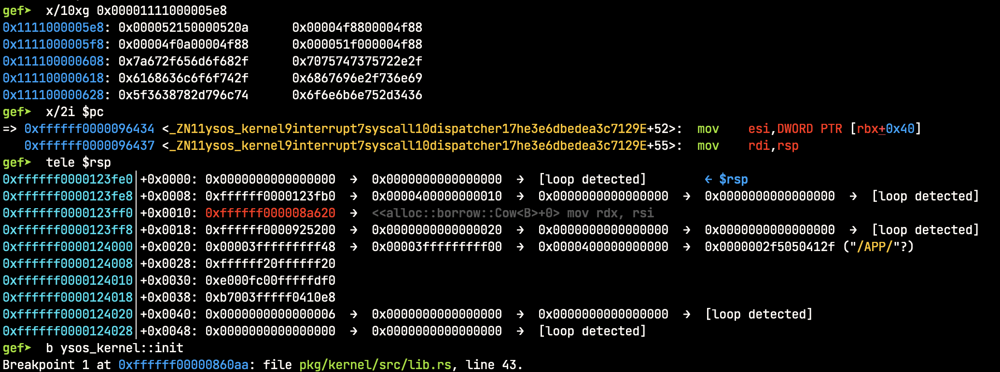
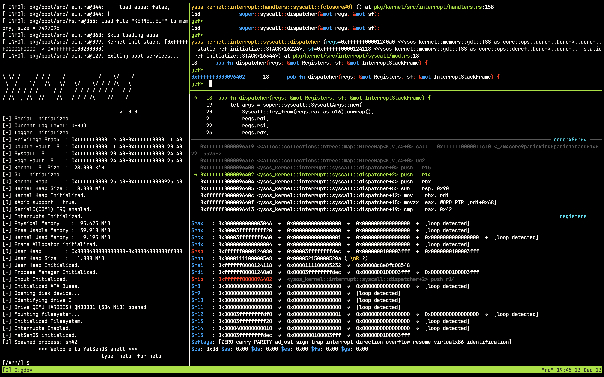
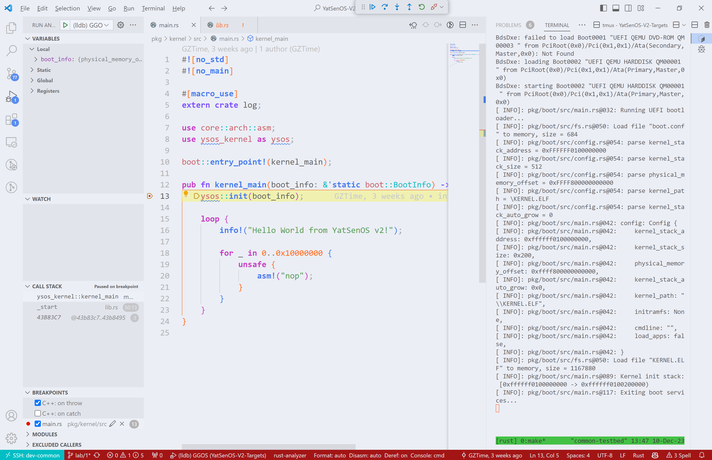

# 程序调试：从 GDB 到 VSCode

## 概述

在写代码时我们很难一蹴而就，往往需要反复观察、不断调试。

最简单的调试方法即“ `printf` 大法”：在代码中插入 `printf` 语句，然后打印程序中间状态，观察输出结果。

尽管便利，但手动插入输出不仅需要调整源码、反复编译，而且不适合本课程的场景。课程要求我们结合 QEMU 开发操作系统内核，简单的输出无法完全支持我们观察内核的运行状态如寄存器、内存乃至函数调用栈等需求。

因此，本章 Wiki 将从 GDB 出发，介绍更为便利的程序调试方法论，同时结合先进的插件（gef）和强大的 IDE（VSCode）介绍进一步提高调试效率的方法。

!!! note "开始之前"

    本章内容仅提供了一个快速上手的必备方法以及简略的参考资料。我们鼓励大家主动查找、翻阅应用文档，以解锁高阶调试技巧。

## 基本方法：GDB

GDB（GNU Debugger）是一个功能强大的开源调试器，用于调试各种编程语言的程序。它是 GNU 项目的一部分，可在多个操作系统上使用。GDB 提供了一系列强大的调试功能，如断点调试、内存查看、堆栈跟踪以及远程调试等，帮助开发者诊断和修复程序中的错误。

在正式开始之前，我们需要准备好 GDB。GDB 的安装非常简单，主流的 Linux 的包管理器都提供了 GDB 的安装包。在 Ubuntu 下，我们只需要执行以下指令：

```bash
sudo apt install gdb
```

其次，为了能够在 GDB 中调试内核，我们需要在编译时开启调试符号的生成。

贴心的 TA 已经在 `Makefile` 中为大家准备好了相关指令，只需要在编译时加上 `DBG_INFO=true` 即可，指令示例如下：

```bash
make build DBG_INFO=true
```

当观察到终端输出如下信息时，说明带调试符号已经生成成功：

```log
Finished release-with-debug [optimized + debuginfo] target(s) in 0.04s
```

!!! tip "调试符号"

    调试符号文件是编译器在编译时生成的一种特殊文件，其中包含了：

    - **源代码中的符号**（变量名、函数名等）；
    - 编译后的二进制文件中的**地址的对应关系**。

    调试符号文件可以帮助调试器在调试时将二进制文件中的地址转换为源代码中的符号，从而方便我们调试。

    如果感兴趣的话，你可以使用反编译工具（如 `readelf -S` 或者 `objdump -g` 等）来查看调试符号的内容。

最后，是一些 GDB 的基本使用方法。在本课程中，我们主要使用 GDB 的以下几个功能：

1. `file <path-to-binary>`：加载调试的二进制文件，如加载 `ysos` 内核二进制: `file esp/KERNEL.ELF`

2. 远程连接：QEMU 提供了 GDB 服务器暴露远程调试接口。我们可以通过 GDB 连接到对应服务器，进而调试 QEMU 中运行的内核。

   - QEMU 设置：请参考[QEMU Wiki](./qemu.md)中对`-s`参数的解释。
   - GDB 设置： `target remote <ip>:<port>`：连接到远程调试服务器，如连接到 QEMU 的 GDB 服务器：`target remote localhost:1234`
   - 使用 gef 时进行远程调试：`gef-remote <ip> <port>`：连接到远程调试服务器，如：`gef-remote localhost 1234`

3. `run`：运行程序，简写为 `r`。

4. `continue`：继续执行程序，直到遇到断点或者程序结束。简写为 `c`。

5. `next`：执行下一条指令，**不会进入函数**。简写为 `n`。

6. `step`：执行下一条指令，**会进入函数**。简写为 `s`。

7. `list`：查看源代码和可用断点，简写为 `l`。

8. `break <function>`：在指定函数处设置断点，如在`main`函数处设置断点：`break ysos_kernel::<todo>`。简写为 `b`。

9. `bt`：查看函数调用栈。

10. `x/<n>x <addr>`：查看内存中的数据，从 `<addr>` 开始，连续查看 `<n>` 个字节。

    - 若要查看内存中的前 16 个字节：`x/16x <addr>`。简写为 `x`。
    - 若要查看 $rdi$ 寄存器指向的内存中的前 16 个字节，可以使用 `x/16x $rdi`。
    - 若要查看内存中对应的 20 条汇编指令，可以使用 `x/20i <addr>`：

11. `info registers`：查看寄存器的值。

12. `grep <pattern>`：在内存中搜索 `<pattern>`，如搜索字符串 "YatSenOS"：`grep YatSenOS`。详细可见文档：[search-pattern - gef](https://hugsy.github.io/gef/commands/search-pattern)

一些简单的命令使用示例如下图展示：



为了方便初始化一个调试会话，我们常常使用 `.gdbinit` 来配置和初始化 gdb。

GDB 在启动时会默认调用该脚本，我们可以在其中设置GDB的默认行为，减少重复操作。这里附上一个 `.gdbinit` 以供参考：

```bash
file esp/KERNEL.ELF
gef config context.layout "-legend regs -stack code -args source -threads -trace extra memory"
gef-remote localhost 1234
tmux-setup
b ysos_kernel::init
```

!!! tip "GDB 用法提示"

    万丈高楼平地起，GDB 的使用也是如此。下文介绍的所有高级功能都基于 GDB / LLDB，我们建议大家尽能理解并掌握上述基本指令。

以上是 GDB 的基本使用方法，更多的 GDB 使用方法请参考：

- [官方文档](https://sourceware.org/gdb/current/onlinedocs/gdb/)
- [知乎：GDB 调试入门指南](https://zhuanlan.zhihu.com/p/74897601)

## 命令行调试进阶：gef

[gef](https://github.com/hugsy/gef) 是一个功能更为强大的调试器插件，用于调试和分析二进制程序。gef 基于 GDB（GNU Debugger），并提供了一系列功能来简化二进制程序的调试过程。在我们的实验场景下，其主要的帮助有：

1. 进阶调试指令：在原生 GDB 的基础上，gef 提供了一个更加丰富的调试指令集，帮助我们更灵活调试。

2. 调试信息展示：gef 可以显示二进制程序的调试信息，如符号表、函数名、堆栈跟踪等。相较于 GDB，其**默认常驻**显示以上信息，简化操作。

3. 脚本和扩展支持：gef 允许用户编写脚本和扩展，以满足特定的调试需求。用户可以编写自定义命令、自动化调试任务、定制常驻显示窗口等。

参照[官方文档](https://hugsy.github.io/gef/install/)，以下是**数个**参考的安装流程，大家可以根据自己的**网络情况**灵活选择：

```bash
# via the install script
## using curl
$ bash -c "$(curl -fsSL https://gef.blah.cat/sh)"

## using wget
$ bash -c "$(wget https://gef.blah.cat/sh -O -)"

# or manually
$ wget -O ~/.gdbinit-gef.py -q https://gef.blah.cat/py
$ echo source ~/.gdbinit-gef.py >> ~/.gdbinit

# or alternatively from inside gdb directly
$ gdb -q
(gdb) pi import urllib.request as u, tempfile as t; g=t.NamedTemporaryFile(suffix='-gef.py'); open(g.name, 'wb+').write(u.urlopen('https://tinyurl.com/gef-main').read()); gdb.execute('source %s' % g.name)
```

完整调试效果如下：



!!! note "gef 用法提示"

    gef 的使用方法与 GDB 类似，但是其提供了更多的功能，也有一个更加炫酷的界面。

    以上截图展示效果正是源于 gef 提供的指令 `gef config context.layout` 和 `gef config context.redirect`。

    请阅读[官方文档](https://hugsy.github.io/gef)来学习如何定制你的调试界面、如何使用 gef 的其余功能。

## IDE 调试进阶：VSCode

VSCode 是一个轻量级的跨平台编辑器，支持多种编程语言，同时提供了丰富的插件支持。因此，除了**简单的代码编辑器**功能，VSCode 还可以作为**强大的 IDE **使用。在本节中，我们将介绍如何使用 VSCode 进行调试。

!!! tip "调试提示"

    所有源码级别的调试工具都需要二进制文件中包含调试符号。

    因此，我们需要在编译时加上 `DBG_INFO=true` 参数，以生成带调试符号的二进制文件。

### 配置 VSCode

首先，我们需要准备调试器的二进制。经测试，我们发现 LLDB（LLVM Debugger）更为顺手，因此我们将使用 LLDB 作为调试器。在 Ubuntu 下，我们可以通过以下指令安装 LLDB：

```bash
sudo apt install lldb
```

其次，我们需要安装 VSCode 的插件：[CodeLLDB](https://marketplace.visualstudio.com/items?itemName=vadimcn.vscode-lldb)，基于 LLDB、用于调试。

最后，我们需要在 VSCode 中配置调试器。在当前目录下创建 `.vscode/launch.json` 文件，内容如下：

```json
{
    "version": "0.2.0",
    "configurations": [
        {
            "name": "(lldb) YSOS",
            "type": "lldb",
            "request": "launch",
            "program": "<path-to-binary>",
            "args": [],
            "cwd": "${workspaceFolder}",
            "initCommands": [
                "settings set target.exec-search-paths <path-to-lldb>",
                "file <path-to-binary>"
            ],
            "processCreateCommands": [
                "gdb-remote 1234"
            ]
        }
    ]
}
```

!!! note "注意"

    不要直接复制配置文本，请先完成任务总的思考题。

    请将 `<path-to-binary>` 替换为你的二进制文件的路径，将 `<path-to-lldb>` 替换为你的 LLDB 的路径。

### 启动调试

完成以上配置后，我们就可以在 VSCode 中调试内核了。首先，我们完成内核编译，并启动 QEMU 调试。贴心的 TA 已经将指令集成进 Makefile 中，只需要执行以下指令即可：

```bash
make run DBG_INFO=true
```

在VSCode中设置任何你想要的断点，按下 `F5` 即可开始调试。例如，我们想调试内核入口函数：



以上即是 VSCode + LLDB 的调试效果。我们可以看到，VSCode 提供了一个非常方便的调试界面，同时也提供了丰富的调试功能：

- 可以在左侧的 `VARIABLES` 中查看变量的值；
- 也可以在 `CALL STACK` 中查看函数调用栈。
- 更多的调试功能请参考[官方文档](https://code.visualstudio.com/docs/editor/debugging)。

以上即基本调试方法入门，欢迎大家探索属于自己的调试工具链。
