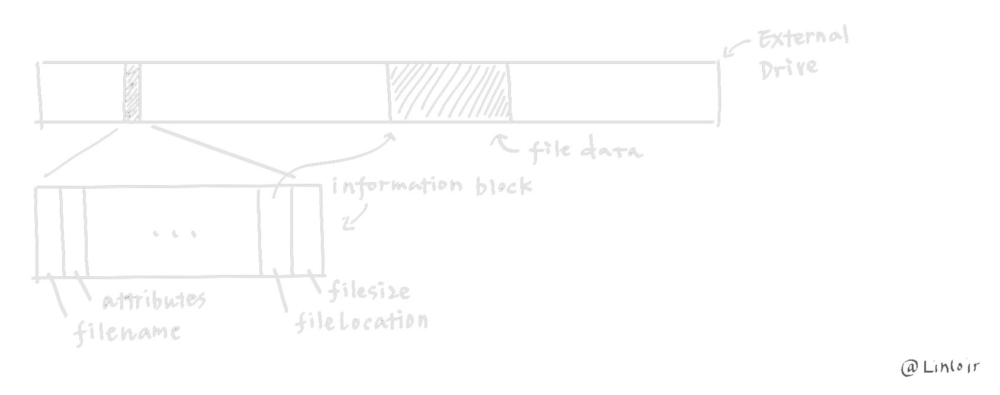
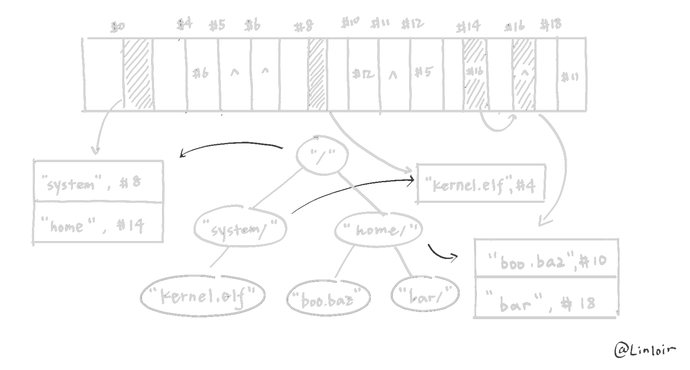
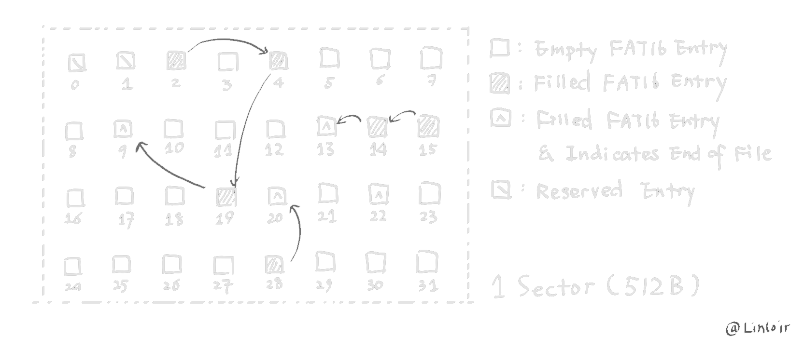

# FAT 文件系统

## 导读：文件、目录和文件系统

文件系统是对文件的一种组织形式，所以文件固然也就是文件系统中至关重要的部分，了解文件系统首先就要了解文件的构成。

不论是哪种类型的文件，不论是 `.doc`、`.ppt` 还是 `.txt` 抑或是 `.bin`，在硬盘的视角来看，它们中的数据实际上都是一系列二进制的数据块，而类别的区别只在于这些数据内部的组织形式，并不会让它们看起来是除了二进制数据块以外的其他样子。

但是如果一个文件只有数据块又不太够，文件名称是用户用以区分不同文件的关键信息，文件名称有时候对于文件系统来说太复杂了，所以文件系统会用一些特殊的方式记录用户提供的文件名称并通过其来识别不同的文件，这种记录有时候会呈现以标识符的形式，在 FAT 文件系统中则是一系列字符串。

除此之外，文件还需要一些其他的信息，例如其类型、数据在硬盘上的位置、尺寸、访问权限、创建或修改日期等等。

可见，文件由两个关键的部分组成，一个是文件的数据，也就是一系列二进制数据块，另一个则是文件的信息，它用来区分不同的文件并在硬盘上定位到文件数据的位置。



在文件系统组织文件的时候，其实际上就是在建立索引文件的数据结构，由于文件是由两部分构成的，文件系统中也就存在着两种主要的数据结构，分别用来索引文件的这两个组成部分。

其中一个数据结构用来索引文件的信息，这部分数据结构一般呈现树形的结构，文件系统中的文件目录就是由这个数据结构所维护的，树中每个节点都存储着一个文件或是目录的信息。


另一个数据结构则用于通过文件的信息来索引文件的数据，由于一个文件可能跨越数个甚至数十、数百个扇区，由于文件时时刻刻都可能会被更改，所以没有办法预先给文件分配一段固定的、连续的、大小适当的空间，因此文件的数据往往分散在磁盘的各个位置，这时就需要一个数据结构来将这些游离的数据块串接起来。说到这里，可能大家就已经能猜到，这部分数据结构一般以链表的形式出现。每一个文件块都对应着一个下一文件块的位置信息，而第一个文件块的位置信息则存储于文件的信息中。

下图表示了一个文件系统磁盘中可能的样子：

`#0` 标号的内存空间对应着系统的根目录 `/` 节点，其内部有两个有效的文件信息，分别是 `system` 和 `home`，均为目录类别。
`system` 首文件块指向 `#8`，并且 `#8` 为其最后一个文件块，因此 `#8` 实际上就对应着 `/system/` 节点，其中存储了 `kernel.elf` 一个文件的信息。
对于 `home`，首文件块指向 `#14`，其下一个文件块为 `#16`，并且是最后一个文件块，因此 `#14`, `#16` 共同构成 `/home/` 节点，在这个节点中存储了两个有效文件信息，分别是 `boo.baz` 和 `bar`，分别是文件和目录。
`kernel.elf` 首文件块为 `#4`，`#4` 下一个文件块为 `#6`，`#6` 为最后一个文件块，因此 `kernel.elf` 对应的文件数据为 `#4`, `#6` 上的数据。
`boo.baz` 首文件块为 `#10`，后续文件块依次为 `#12`、`#5`。因此 `#10`, `#12`, `#5` 共同构成 `boo.baz` 文件的数据
`bar` 首文件块指向 `#18`，后续文件块为 `#11`，因此 `#18`, `#11` 共同构成了目录树中的 `/home/bar/` 节点的子树信息



由上图可以看出，目录树的遍历方式是要与数据结构中树的遍历方式有很大不同的。每一个节点实际上都对应着一个存储着其子节点的文件的信息的数组，通过这个数组，可以获得子节点对应文件的首块信息，再依据链表就能够获得全部的文件数据。只有当取得了全部的文件数据，才可以进入下一层的节点。

简单来说，就是在 `/` 目录下，我们只能得到 `system/` 和 `home/` 的信息，但是我们不能从这些信息中直接得到 `system/` 下或是 `home/` 下有什么文件，除非我们把它们的数据完整地读取出来。

而在一般的数据结构中，对于根节点 `root`，我们只需要访问 `child = root->children[0]` 就可以获得整个子节点，得到的 `child` 就包含了其所有的子节点数据，而不需要额外的加载操作。

现在，假设我们需要访问 `/system/kernel.elf` 文件，那么就需要

首先从树的根部开始，找到类型为目录，名称为 `system` 的信息
从信息中读取出目录数据的第一个块 `#8`，并根据链表中的信息读入整个目录，由于这里只有一个块，所以就读入 `#8`
在目录的数据中找到类型为文件，名称为 `kernel.elf` 的信息
从信息中读出文件数据的第一个块 `#4`，并根据链表读入 `#6`，得到整个文件。

为了提高文件读写的速度，系统一般会维护一个打开的文件表 (Open-file table) 用于维护所有打开的文件的信息，所以一般来说，当打开一个文件的时候，除了会将它的全部数据就被读取到内存中，还会将其信息添加到打开文件表中，后续所有的增删改都只会对内存中的数据起作用，直到文件关闭时才再次写回磁盘。这样就避免了每次读写过程中对文件数据的定位以及读取。

## 导读：FAT

导读中的内容只是对文件系统的一种简单的概述，不同的文件系统会有不同的组织文件的方式，但核心总还是离不开怎样组织文件的数据以及如何通过文件的信息索引到文件的数据，区别大抵是数据结构的差异以及具体实现上的差异。

在上世纪出现的 FAT 中，由于软盘随机读取的性能奇差，所以如果像上文中图片绘制的那样，在文件数据块的末尾添加上下一个文件块的信息，糟糕的问题就会出现：如果尝试在文件尾部添加些什么，那需要遍历之前所有的文件块才能知道最后一个文件块在哪个位置！

为此，工程师们将所有文件块中关于下一个块的信息独立出来，存放在磁盘中的一个连续的空间内，这个空间也被称作文件分配表 (File Allocation Table)，也就是 FAT 实际的意义。这样，只需要提前把这一部分空间读取到内存中，就可以很快地定位到文件任意个块的信息了。



同时，这样做还有一个好处，一个 512 字节或是其整数倍的块需要分配几个字节给下一个块的块号，导致每个文件块实际数据大小不是 2 的幂，现在由于将这部分信息独立出来，所以每一个文件块都是完整的 512 字节或是 512 字节的倍数。

但是，如果每个数据块只占据 1 个扇区的话，对于大磁盘来说，需要的块号还是太多了，于是工程师就提出了簇 (cluster) 的概念，一簇由许多个扇区组成，而这个簇就相当于前文中的数据块。

这样，在 FAT 中存储簇号就大大减少了 FAT 的大小，虽然增加了碎片，但是提升了文件读写的效率。

## 实现

在了解了文件系统是怎样组织和存储文件之后，对于如何从文件系统中读取文件应该有了思路。

但是细细一想又会发现很多问题，例如：根目录存储在磁盘的哪个位置、如何知道一个簇有多大、文件名是如何存储的、怎样才代表当前的簇是文件的最后一个簇等等

这便是因为文件系统很多具体的细节还没有落实，程序还无法从现有的文件系统中获得需要的数据。而这就是本节的目的，通过阅读 [微软关于 FAT 文件系统的规范文档](<assets/fat/FAT32 Spec.pdf>)，对 FAT 文件系统进行抽象，并且提供接口来解决上面提到的种种问题。

### 定义与注解

第一章大体可以略过，其中较为重要的概念如下：

- 簇 (cluster)： 文件分配的单元 (A unit of allocation)，其中包括了一组逻辑连续的扇区。卷内的每个簇都可以通过一个簇号 N 指代 (referred to)。给任何一个文件所分配的全部空间的大小 *(All allocation for a file)* 必须是簇的整数倍。
- 分区 (partition)： 在一个卷内的一系列扇区
- 卷 (volume)： 一个逻辑上的连续的扇区地址空间

### FAT卷结构

第二章主要介绍了 FAT 格式卷的结构，除了上文中提到的用来存储下一个簇信息的 FAT 区域 (FAT Region) 以及存储文件数据的区域 (File and Directory Data Region) ，还包括了一个保留区 (Reserved Region) 和一个根目录区 (Root Directory Region) 。

一个 FAT 格式的卷结构大概长得就像下面这样


!!! note "小端模式"

    由于所有的 FAT 文件系统都是为 IBM PC 机器的架构所设计，因此其数据结构在硬盘上的存储方式都是小端模式。

### BPB

在 FAT 格式的卷的首扇区，有一个叫做 BPB (Bios Parameter Block) 的数据结构，其主要存储了关于当前卷上 FAT 文件系统的关键信息，包括了文件系统各个区域的首扇区号，以及簇大小等等。

!!! note "注"

    首扇区并不是所有的内容都属于 BPB 结构体的范畴，在后续的介绍中，以 BPB_ 开头的域才是属于 BPB 结构体的域

    In the following description, all the fields whose names start with BPB_ are part of the BPB. All the fields whose names start with BS_ are part of the boot sector and not really part of the BPB.

对于 FAT12/16 和 FAT32，它们的 BPB 结构在首 36 字节上完全一致：

<table>
    <thead>
        <tr>
            <th style="text-align:center">域名称</th>
            <th style="text-align:center">偏移</th>
            <th style="text-align:center">大小</th>
            <th style="text-align:center">描述</th>
            <th style="text-align:center">限制</th>
        </tr>
    </thead>
    <tbody>
        <tr>
            <td style="text-align:center">BS_jmpBoot</td>
            <td style="text-align:center">0</td>
            <td style="text-align:center">3</td>
            <td style="text-align:center">跳转到启动代码处执行的指令<br/>由于实验中启动代码位于MBR，不会从这里进行启动，因此可以不用关心这个域实际的内容</td>
            <td style="text-align:center">一般为<code>0x90**EB</code>或是<code>0x****E9</code></td>
        </tr>
        <tr>
            <td style="text-align:center">BS_OEMName</td>
            <td style="text-align:center">3</td>
            <td style="text-align:center">8</td>
            <td style="text-align:center">OEM厂商的名称，同样与实验无关，不需要关心</td>
            <td style="text-align:center">-</td>
        </tr>
        <tr>
            <td style="text-align:center"><strong>BPB_BytsPerSec</strong></td>
            <td style="text-align:center">11</td>
            <td style="text-align:center">2</td>
            <td style="text-align:center"><strong>每个扇区的字节数</strong></td>
            <td style="text-align:center"><strong>只能是512、1024、2048或4096</strong></td>
        </tr>
        <tr>
            <td style="text-align:center"><strong>BPB_SecPerClus</strong></td>
            <td style="text-align:center">13</td>
            <td style="text-align:center">1</td>
            <td style="text-align:center"><strong>每个簇的扇区数量</strong></td>
            <td style="text-align:center"><strong>只能是1、2、4、8、16、32、64和128</strong></td>
        </tr>
        <tr>
            <td style="text-align:center"><strong>BPB_RsvdSecCnt</strong></td>
            <td style="text-align:center">14</td>
            <td style="text-align:center">2</td>
            <td style="text-align:center"><strong>保留区域的扇区数量</strong><br/>可以用来计算FAT区域的首扇区位置</td>
            <td style="text-align:center"><strong>不能为0，可以为任意非0值</strong><br/>可以用来将将数据区域与簇大小对齐（使数据区域的起始偏移位于簇大小的整数倍处）</td>
        </tr>
        <tr>
            <td style="text-align:center"><strong>BPB_NumFATs</strong></td>
            <td style="text-align:center">16</td>
            <td style="text-align:center">1</td>
            <td style="text-align:center"><strong>FAT表数量</strong></td>
            <td style="text-align:center">一般为2，也可以为1</td>
        </tr>
        <tr>
            <td style="text-align:center"><strong>BPB_RootEntCnt</strong></td>
            <td style="text-align:center">17</td>
            <td style="text-align:center">2</td>
            <td style="text-align:center"><strong>根目录中的条目数</strong><br/>指根目录中包含的所有的条目数量，包括有效的、空的和无效的条目<br/>可以用来计算根目录区所占用的字节数</td>
            <td style="text-align:center"><strong>FAT32：</strong> 必须为0<br/><strong>FAT12/16：</strong> 必须满足<span class="katex"><span class="katex-mathml"><math xmlns="http://www.w3.org/1998/Math/MathML"><semantics><mrow><mo stretchy="false">(</mo><mi>B</mi><mi>P</mi><mi>B</mi><mi mathvariant="normal">_</mi><mi>R</mi><mi>o</mi><mi>o</mi><mi>t</mi><mi>E</mi><mi>n</mi><mi>t</mi><mi>C</mi><mi>n</mi><mi>t</mi><mo>×</mo><mn>32</mn><mo stretchy="false">)</mo><mo>≡</mo><mn>0</mn><mtext>  </mtext><mo stretchy="false">(</mo><mi>m</mi><mi>o</mi><mi>d</mi><mtext>  </mtext><mn>2</mn><mo stretchy="false">)</mo></mrow><annotation encoding="application/x-tex">(BPB\_RootEntCnt \times 32) \equiv 0\;(mod\;2)</annotation></semantics></math></span><span class="katex-html" aria-hidden="true"><span class="base"><span class="strut" style="height:1.06em;vertical-align:-0.31em;"></span><span class="mopen">(</span><span class="mord mathnormal" style="margin-right:0.05017em;">BPB</span><span class="mord" style="margin-right:0.02778em;">_</span><span class="mord mathnormal" style="margin-right:0.00773em;">R</span><span class="mord mathnormal">oo</span><span class="mord mathnormal" style="margin-right:0.05764em;">tE</span><span class="mord mathnormal">n</span><span class="mord mathnormal" style="margin-right:0.07153em;">tC</span><span class="mord mathnormal">n</span><span class="mord mathnormal">t</span><span class="mspace" style="margin-right:0.2222em;"></span><span class="mbin">×</span><span class="mspace" style="margin-right:0.2222em;"></span></span><span class="base"><span class="strut" style="height:1em;vertical-align:-0.25em;"></span><span class="mord">32</span><span class="mclose">)</span><span class="mspace" style="margin-right:0.2778em;"></span><span class="mrel">≡</span><span class="mspace" style="margin-right:0.2778em;"></span></span><span class="base"><span class="strut" style="height:1em;vertical-align:-0.25em;"></span><span class="mord">0</span><span class="mspace" style="margin-right:0.2778em;"></span><span class="mopen">(</span><span class="mord mathnormal">m</span><span class="mord mathnormal">o</span><span class="mord mathnormal">d</span><span class="mspace" style="margin-right:0.2778em;"></span><span class="mord">2</span><span class="mclose">)</span></span></span></span></td>
        </tr>
        <tr>
            <td style="text-align:center"><strong>BPB_TotSec16</strong></td>
            <td style="text-align:center">19</td>
            <td style="text-align:center">2</td>
            <td style="text-align:center"><strong>16位长度卷的总扇区数</strong><br/>对于FAT32和更大容量的存储设备有额外的BPB_TotSec32域<br/>应当是为了维持BPB结构的一致性而仍然保留了这个域</td>
            <td style="text-align:center"><strong>FAT32：</strong> 必须位0<br/><strong>FAT12/16：</strong> 如果总扇区数小于0x10000（也就是能用16位表示）则使用此域表示，否则也使用BPB_TotSec32域</td>
        </tr>
        <tr>
            <td style="text-align:center">BPB_Media</td>
            <td style="text-align:center">21</td>
            <td style="text-align:center">1</td>
            <td style="text-align:center">似乎是设备的类型<br/>与实验无关，所以可以不用特别关心</td>
            <td style="text-align:center">合法取值包括<code>0xF0</code>、<code>0xF8</code>、<code>0xF9</code>、<code>0xFA</code>、<code>0xFB</code>、<code>0xFC</code>、<code>0xFD</code>、<code>0xFE</code>和<code>0xFF</code><br/>本地磁盘（不可移动）的规定值为<code>0xF8</code><br/>可移动磁盘的往往使用<code>0xF0</code></td>
        </tr>
        <tr>
            <td style="text-align:center"><strong>BPB_FATSz16</strong></td>
            <td style="text-align:center">22</td>
            <td style="text-align:center">2</td>
            <td style="text-align:center"><strong>单个FAT表占用的扇区数</strong><br/>只用于FAT12/16格式的文件系统</td>
            <td style="text-align:center"><strong>FAT32：</strong> 必须为0<br/><strong>FAT12/16：</strong> 正整数值</td>
        </tr>
        <tr>
            <td style="text-align:center">BPB_SecPerTrk</td>
            <td style="text-align:center">24</td>
            <td style="text-align:center">2</td>
            <td style="text-align:center">每个扇区的磁道数<br/>与<code>0x13</code>中断相关<br/>只与具有物理结构（如磁道、磁盘等）并且对<code>0x13</code>中断可见的存储介质有关<br/>与实验无关，可以不用关心</td>
            <td style="text-align:center">-</td>
        </tr>
        <tr>
            <td style="text-align:center">BPB_NumHeads</td>
            <td style="text-align:center">26</td>
            <td style="text-align:center">2</td>
            <td style="text-align:center">磁头数量<br/>同样与<code>0x13</code>中断相关，实验不会使用，所以可以不用关心</td>
            <td style="text-align:center">-</td>
        </tr>
        <tr>
            <td style="text-align:center"><strong>BPB_HiddSec</strong></td>
            <td style="text-align:center">28</td>
            <td style="text-align:center">4</td>
            <td style="text-align:center"><strong>分区前隐藏的扇区数</strong><br/>在文档中描述这个域为同样只与对<code>0x13</code>中断可见的存储介质有关，但在实验过程中发现对于一个多分区的磁盘，这个域对应了<strong>分区首扇区在整个磁盘中的扇区号</strong>，例如首扇区位于磁盘2048扇区（从0开始计算分区号）的分区，其BPB_HiddSec域值就为2048</td>
            <td style="text-align:center">-</td>
        </tr>
        <tr>
            <td style="text-align:center"><strong>BPB_TotSec32</strong></td>
            <td style="text-align:center">32</td>
            <td style="text-align:center">4</td>
            <td style="text-align:center"><strong>32位长度卷的总扇区数</strong><br/>用来描述FAT32卷中的总扇区数或是扇区数多于0x10000的FAT12/16卷中的总扇区数</td>
            <td style="text-align:center"><strong>FAT32：</strong> 必须为非零整数值<br/><strong>FAT12/16：</strong> 如果扇区数大于0x10000，则为扇区数，否则必须为0</td>
        </tr>
    </tbody>
</table>

从第 37 字节开始，FAT12 和 FAT16 卷上的 BPB 结构如下：

<table>
    <thead>
        <tr>
            <th style="text-align:center">域名称</th>
            <th style="text-align:center">偏移</th>
            <th style="text-align:center">大小</th>
            <th style="text-align:center">描述</th>
            <th style="text-align:center">限制</th>
        </tr>
    </thead>
    <tbody>
        <tr>
            <td style="text-align:center">BS_DrvNum</td>
            <td style="text-align:center">36</td>
            <td style="text-align:center">1</td>
            <td style="text-align:center">用于<code>0x13</code>中断的驱动器号，可以不用关心</td>
            <td style="text-align:center">应当设置为<code>0x80</code>或是<code>0x00</code></td>
        </tr>
        <tr>
            <td style="text-align:center">BS_Reserved1</td>
            <td style="text-align:center">37</td>
            <td style="text-align:center">1</td>
            <td style="text-align:center">保留位</td>
            <td style="text-align:center">必须为0</td>
        </tr>
        <tr>
            <td style="text-align:center">BS_BootSig</td>
            <td style="text-align:center">38</td>
            <td style="text-align:center">1</td>
            <td style="text-align:center">用来检验启动扇区的完整性的签名，可以不用关心</td>
            <td style="text-align:center">如果BS_VolID、BS_VolLab和BS_FilSysType三个域都存在有效的值 <em>(present)</em>，则置为<code>0x29</code></td>
        </tr>
        <tr>
            <td style="text-align:center">BS_VolID</td>
            <td style="text-align:center">39</td>
            <td style="text-align:center">4</td>
            <td style="text-align:center">卷的序列号，可以不用关心</td>
            <td style="text-align:center">-</td>
        </tr>
        <tr>
            <td style="text-align:center">BS_VolLab</td>
            <td style="text-align:center">43</td>
            <td style="text-align:center">11</td>
            <td style="text-align:center">卷标，可以不用关心<br/>在文档中，要求与根目录下的卷标描述文件保持内容一致，但实际上在测试中往往卷标描述文件中存储的是真实的卷标而这个域的内容仍为缺省值&quot;No NAME&quot;</td>
            <td style="text-align:center">缺省值为&quot;NO NAME&quot;</td>
        </tr>
        <tr>
            <td style="text-align:center">BS_FilSysType</td>
            <td style="text-align:center">54</td>
            <td style="text-align:center">8</td>
            <td style="text-align:center">用来描述文件系统类型，但<strong>不能用来作为判断文件系统类型的依据</strong></td>
            <td style="text-align:center">“FAT12”、“FAT16&quot;或是&quot;FAT32”</td>
        </tr>
        <tr>
            <td style="text-align:center">-</td>
            <td style="text-align:center">62</td>
            <td style="text-align:center">448</td>
            <td style="text-align:center">空余，置零</td>
            <td style="text-align:center">必须为0</td>
        </tr>
        <tr>
            <td style="text-align:center">Signature_word</td>
            <td style="text-align:center">510</td>
            <td style="text-align:center">2</td>
            <td style="text-align:center">校验位</td>
            <td style="text-align:center">设置为<code>0xAA55</code></td>
        </tr>
        <tr>
            <td style="text-align:center">-</td>
            <td style="text-align:center">512</td>
            <td style="text-align:center">*</td>
            <td style="text-align:center">如果<span class="katex"><span class="katex-mathml"><math xmlns="http://www.w3.org/1998/Math/MathML"><semantics><mrow><mi>B</mi><mi>P</mi><mi>B</mi><mi mathvariant="normal">_</mi><mi>B</mi><mi>y</mi><mi>t</mi><mi>s</mi><mi>P</mi><mi>e</mi><mi>r</mi><mi>S</mi><mi>e</mi><mi>c</mi><mo>&gt;</mo><mn>512</mn></mrow><annotation encoding="application/x-tex">BPB\_BytsPerSec \gt 512</annotation></semantics></math></span><span class="katex-html" aria-hidden="true"><span class="base"><span class="strut" style="height:0.9933em;vertical-align:-0.31em;"></span><span class="mord mathnormal" style="margin-right:0.05017em;">BPB</span><span class="mord" style="margin-right:0.02778em;">_</span><span class="mord mathnormal" style="margin-right:0.05017em;">B</span><span class="mord mathnormal" style="margin-right:0.03588em;">y</span><span class="mord mathnormal">t</span><span class="mord mathnormal">s</span><span class="mord mathnormal" style="margin-right:0.13889em;">P</span><span class="mord mathnormal" style="margin-right:0.02778em;">er</span><span class="mord mathnormal" style="margin-right:0.05764em;">S</span><span class="mord mathnormal">ec</span><span class="mspace" style="margin-right:0.2778em;"></span><span class="mrel">&gt;</span><span class="mspace" style="margin-right:0.2778em;"></span></span><span class="base"><span class="strut" style="height:0.6444em;"></span><span class="mord">512</span></span></span></span>则存在此域，全部置零</td>
            <td style="text-align:center">必须为0</td>
        </tr>
    </tbody>
</table>

文档在接下来的部分介绍了如何初始化一个 FAT 卷，由于目前只需要读取 FAT 卷，所以可以忽略章节 3.4。

在 3.5 章节中文档就介绍了如何在装载卷时判断 FAT 的类型，其中关键的判断算法为

```cpp
if(CountofClusters < 4085) {
  /* Volume is FAT12 */
} else if(CountofClusters < 65525) {
  /* Volume is FAT16 */
} else {
  /* Volume is FAT32 */
}
```

也就是说，FAT 的类型只与簇的数量有关，而与磁盘的大小、扇区数量，包括 BPB 中的 BPB_FilSysType 域都无关，其中

- FAT12 不能有超过 4084 个簇
- FAT16 不能有超过 65524 个簇，也不能少于 4085 个簇

在明白了 BPB 的结构之后，就可以开始着手对 BPB 进行抽象了。

<!-- 这里补充一些 implementation-specific 教程 -->

### FAT

!!! note "回顾"

    如果一个文件大小超过了一个簇，那么用来存储它数据的簇可能在磁盘上并不连续，为了能够将这些分散的簇连起来，文件系统一般会为每一个簇对应一个域用来保存关于它下一个簇的信息，从而就可以如同链表那样将整个文件串联在一起。在 FAT 中，这些域被集中存储在磁盘的一段空间内，这一段空间就叫做 FAT (File Allocation Table)。

对于不同的 FAT 格式，FAT 表中每个条目 (entry) 的大小不同：

- 对于 FAT12 而言，每个条目长 12 位
- 对于 FAT16 而言，每个条目长 16 位
- 对于 FAT32 而言，每个条目长 32 位

这时候就发现了，原来 FAT 后面的数字就是指代的 FAT 表中每个条目的长度，因此对于我们需要实现的 FAT16，每个条目长 16 位

FAT 条目中可能的存储值及其含义如下，其中 MAX 指代磁盘中合法的最大的簇号：

<table>
    <thead>
        <tr>
        <th style="text-align:center">FAT12</th>
        <th style="text-align:center">FAT16</th>
        <th style="text-align:center">FAT32</th>
        <th style="text-align:center">含义</th>
        </tr>
    </thead>
    <tbody>
        <tr>
            <td style="text-align:center">0x000</td>
            <td style="text-align:center">0x0000</td>
            <td style="text-align:center">0x0000000</td>
            <td style="text-align:center">当前条目所对应的簇空闲</td>
        </tr>
        <tr>
            <td style="text-align:center">0x000 ~ MAX</td>
            <td style="text-align:center">0x0002 ~ MAX</td>
            <td style="text-align:center">0x0000002 ~ MAX</td>
            <td style="text-align:center">当前条目所对应的簇存在内容，并且条目的值就是下一个簇的簇号</td>
        </tr>
        <tr>
            <td style="text-align:center">(MAX + 1) ~ 0xFF6</td>
            <td style="text-align:center">(MAX + 1) ~ 0xFFF6</td>
            <td style="text-align:center">(MAX + 1) ~ 0xFFFFFF6</td>
            <td style="text-align:center">保留的值，不能够使用</td>
        </tr>
        <tr>
            <td style="text-align:center">0xFF7</td>
            <td style="text-align:center">0xFFF7</td>
            <td style="text-align:center">0xFFFFFF7</td>
            <td style="text-align:center">当前条目所对应的簇是损坏的簇</td>
        </tr>
        <tr>
            <td style="text-align:center">0xFF8 ~ 0xFFE</td>
            <td style="text-align:center">0xFFF8 ~ 0xFFFE</td>
            <td style="text-align:center">0xFFFFFF8 ~ 0xFFFFFFE</td>
            <td style="text-align:center">保留的值，有时也作为指示当前条目所对应的簇是文件的最后一个簇</td>
        </tr>
        <tr>
            <td style="text-align:center">0xFFF</td>
            <td style="text-align:center">0xFFFF</td>
            <td style="text-align:center">0xFFFFFFF</td>
            <td style="text-align:center">当前条目所对应的簇是文件的最后一个簇</td>
        </tr>
    </tbody>
</table>

!!! danger "FAT 表首两个条目保留"

    注意到上表中有效的 FAT 条目值从 2 开始，因为 FAT 表中的前两个条目是被保留的。
    这也就导致了簇号和实际的簇产生了 2 的偏移：对于任意簇号$N$，当在磁盘上访问实际的簇时，应当访问第$N-2$ 个簇

FAT 表中第一个保留的条目（`FAT [0]`）包含了 `BPB_Media` 域中的内容，其他的位被设置为 `1`，对于 FAT32 高四位同样不进行更改。例如，如果 `BPB_Media` 的值为 `0xF8`，那么

- 对于 FAT12，值为 `0xFF8`
- 对于 FAT16，值为 `0xFFF8`
- 对于 FAT32，值为 `0xFFFFFF8`

第二个保留的条目（`FAT [1]`）在格式化时会被格式化工具赋一个 EOC 值（具体用处不明）。对于 FAT12 而言，由于空间有限，所以并没有额外的标记位，对于 FAT16 和 FAT32 而言，Windows 系统可能会使用高两位作为脏卷的标记位，其中最高位为 `ClnShutBit`，如果该位置位，则意味着上一次该设备没有被正常卸载，可能需要检查文件系统的完整性；次高位为 `HrdErrBit`，如果该位置位，则标明读写功能正常，如果置 `0` 则代表遇到了 IO 错误，提示一些磁盘扇区可能发生了错误。

<!-- 这里补充一些 implementation-specific 教程 -->

### 目录

到目前为止，BPB 以及 FAT 表我们都已经清楚了，这样我们可以顺利地找到根目录所在的区域并且读取根目录所包含的所有数据了：

对于 FAT16，根据保留区的大小以及 FAT 的大小可以计算出根目录区的首扇区位置，根据根目录区首扇区位置和根目录区大小就可以读取全部根目录区数据

实际上，目录同样是一个由目录条目构成的数组，其中每一个目录条目都是一个 32 字节长度的数据结构，而正是这个数据结构中存储的数据描述了一个目录中存储的文件或是一个子目录的详细信息，例如它的创建日期和时间、名称或是最重要的首簇簇号等等。它的完整结构如下：

<table>
    <thead>
        <tr>
            <th style="text-align:center">域名称</th>
            <th style="text-align:center">偏移</th>
            <th style="text-align:center">大小</th>
            <th style="text-align:center">描述</th>
        </tr>
    </thead>
    <tbody>
        <tr>
            <td style="text-align:center">DIR_Name</td>
            <td style="text-align:center">0</td>
            <td style="text-align:center">11</td>
            <td style="text-align:center">短名称格式的文件名</td>
        </tr>
        <tr>
            <td style="text-align:center">DIR_Attr</td>
            <td style="text-align:center">11</td>
            <td style="text-align:center">1</td>
            <td style="text-align:center">文件的属性标记</td>
        </tr>
        <tr>
            <td style="text-align:center">DIR_NTRes</td>
            <td style="text-align:center">12</td>
            <td style="text-align:center">1</td>
            <td style="text-align:center">保留位，必须为0</td>
        </tr>
        <tr>
            <td style="text-align:center">DIR_CrtTimeTenth</td>
            <td style="text-align:center">13</td>
            <td style="text-align:center">1</td>
            <td style="text-align:center">文件创建时间，单位为10ms</td>
        </tr>
        <tr>
            <td style="text-align:center">DIR_CrtTime</td>
            <td style="text-align:center">14</td>
            <td style="text-align:center">2</td>
            <td style="text-align:center">文件创建时间</td>
        </tr>
        <tr>
            <td style="text-align:center">DIR_CrtDate</td>
            <td style="text-align:center">16</td>
            <td style="text-align:center">2</td>
            <td style="text-align:center">文件创建日期</td>
        </tr>
        <tr>
            <td style="text-align:center">DIR_LstAccDate</td>
            <td style="text-align:center">18</td>
            <td style="text-align:center">2</td>
            <td style="text-align:center">文件最近访问日期</td>
        </tr>
        <tr>
            <td style="text-align:center">DIR_FstClusHI</td>
            <td style="text-align:center">20</td>
            <td style="text-align:center">2</td>
            <td style="text-align:center">首簇簇号高16位</td>
        </tr>
        <tr>
            <td style="text-align:center">DIR_WrtTime</td>
            <td style="text-align:center">22</td>
            <td style="text-align:center">2</td>
            <td style="text-align:center">文件修改时间</td>
        </tr>
        <tr>
            <td style="text-align:center">DIR_WrtDate</td>
            <td style="text-align:center">24</td>
            <td style="text-align:center">2</td>
            <td style="text-align:center">文件修改日期</td>
        </tr>
        <tr>
            <td style="text-align:center">DIR_FstClusLO</td>
            <td style="text-align:center">26</td>
            <td style="text-align:center">2</td>
            <td style="text-align:center">首簇簇号低16位</td>
        </tr>
        <tr>
            <td style="text-align:center">DIR_FileSize</td>
            <td style="text-align:center">28</td>
            <td style="text-align:center">4</td>
            <td style="text-align:center">文件的大小，单位为字节</td>
        </tr>
    </tbody>
</table>

其中提到了一些概念，如短名称、文件属性以及一些仍然不明确的结构，如日期和时间的表示格式，如果继续阅读，则会发现文档也一一对它们作出了解释。

短名称为一种表示文件名称的格式，其 11 字节长度的域被分为 8 字节和 3 字节的空间，其中 11 字节用来存储文件不含扩展名的部分，而后 3 字节用来存储文件的扩展名，在存储名字的时候，所有的字母都会以大写字母的形式存储。

同时，短名称的存储方式会在文件名长度小于最大长度时在其后面填补空格，例如 `FOO.BAR` 在存储时由于文件名为三字节，所以会在其后填补 5 个空格，存储为 `FOO     BAR`

除此之外，短名称还遵循以下规则：

- 若首字节为 `0xE5` 则代表当前条目为空
- 若首字节为 `0x00` 则同样代表当前条目为空，并且还代表当前条目之后的所有条目都为空
- 首字节不能为空格，也就是说文件名不能以空格开头
- 目录中不能出现名称相同的两个条目
- 不能出现小写字母
- ASCII 值小于 `0x20` 的字符以及 `0x22`、`0x2A`、`0x2B`、`0x2C`、`0x2E`、`0x2F`、`0x3A`、`0x3B`、`0x3C`、`0x3D`、`0x3E`、`0x3F`、`0x5B`、`0x5C`、`0x5D`、`0x7C`

然而，如果文件名称很长的话，短名称就显得不太够用了，所以 FAT 还额外提出了长名称的解决方案，并且称存储短名称的条目为 SFNEntry，长名称的目录为 LFNEntry。

在长名称的解决方案中，一个文件会对应一个短名称的条目和一系列长名称的条目，短名称条目存储文件名称的前数个字符和扩展名，而长名称则存储文件的全部名称。

在目录中，一个文件对应的长名称条目和短名称条目连续存储，其中地址从低到高依次存储：

- 第 N 个长名称条目
- 第 N-1 个长名称条目
- …
- 第 1 个长名称条目
- 短名称条目

但是目前短名称足够使用了，所以不妨暂时跳过长名称的进一步介绍和实现

<!-- 这里补充一些 implementation-specific 教程 -->

文件的属性使用按位枚举的方式表示，其中的六个二进制位分别如下：

<table>
    <thead>
        <tr>
            <th style="text-align:center">属性</th>
            <th style="text-align:center">位</th>
            <th style="text-align:center">描述</th>
        </tr>
    </thead>
    <tbody>
        <tr>
            <td style="text-align:center">ATTR_READ_ONLY</td>
            <td style="text-align:center">1 &lt;&lt; 0</td>
            <td style="text-align:center">文件只读</td>
        </tr>
        <tr>
            <td style="text-align:center">ATTR_HIDDEN</td>
            <td style="text-align:center">1 &lt;&lt; 1</td>
            <td style="text-align:center">文件隐藏<br/>除非用户或程序显式声明要求访问隐藏的文件，否则不应当在文件列表中被列出</td>
        </tr>
        <tr>
            <td style="text-align:center">ATTR_SYSTEM</td>
            <td style="text-align:center">1 &lt;&lt; 2</td>
            <td style="text-align:center">文件为系统文件<br/>除非用户或程序显式声明要求访问系统文件，否则不应当在文件列表中被列出</td>
        </tr>
        <tr>
            <td style="text-align:center">ATTR_VOLUME_ID</td>
            <td style="text-align:center">1 &lt;&lt; 3</td>
            <td style="text-align:center">文件用来描述卷标</td>
        </tr>
        <tr>
            <td style="text-align:center">ATTR_DIRECTORY</td>
            <td style="text-align:center">1 &lt;&lt; 4</td>
            <td style="text-align:center">文件实际上是一个目录</td>
        </tr>
        <tr>
            <td style="text-align:center">ATTR_ARCHIVE</td>
            <td style="text-align:center">1 &lt;&lt; 5</td>
            <td style="text-align:center">当文件被创建、重命名或修改时置位，指示文件是否被修改过</td>
        </tr>
    </tbody>
</table>

!!! danger "卷标文件只能出现在根目录"

    卷标文件为根目录中描述卷标的特殊文件，其 DIR_NAME 域全部用来存储卷标，同时属性域为 0x8，也即 ATTR_VOLUME_ID，其他部分均为 0。

文件的日期和时间有特殊的存储格式

其中文件的日期包括三个部分：

- `[4:0]`：日（从 1 至 31）
- `[8:5]`：月（从 1 至 12）
- `[9]`：从 1980 年起的年份偏移（从 0 至 127）

文件的时间同样也包括三个部分：

- `[4:0]`：从零起经过的 2s 间隔数（从 0 至 29）
- `[10:5]`：分（从 0 至 59）
- `[15:11]`：时（从 0 至 23）

可以看到，秒的精度为 2s，这也就引出了 CrtTimeTenth 这个域，其精度为 10ms，范围从 0 至 199，正好填补了 2s 之间的空缺，使得精度提高到 10ms

在了解了目录的结构之后，就可以着手对目录进行抽象了。由于目录本身还是相当于关于目录条目的数组，所以根本在于对目录条目进行抽象。

## 参考

[Bilibili 上南京大学操作系统课程中关于 FAT 和 UNIX 文件系统知识的讲解](https://www.bilibili.com/video/BV1oZ4y1t7ce)
