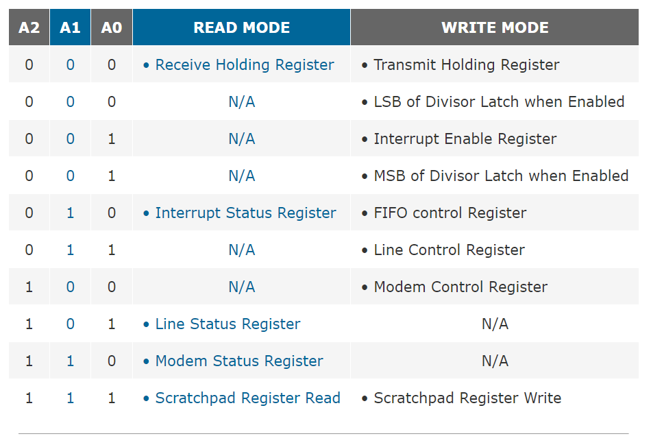

# 串口输出简介

## 概述

处理器与外部设备进行通信有两种方式：并行通信与串行通信。与之对应的是两种硬件接口：并行接口与串行接口。并行接口通常用于高速数据传输，例如连接打印机、显示器、硬盘等设备。由于替代技术的普及和串口协议的迭代，并口其在计算机领域的使用程度已经大幅下降。基于实用性和实现的简便考虑，在实验前期我们使用串口输出内核信息。

串口（Serial Port）是一种常见的计算机接口，用于在计算机和外部设备之间进行**串行**数据传输。串口是一种通用的调试接口，几乎所有计算机和嵌入式设备都提供了串口接口。这使得串口成为一种广泛支持的调试方法，可以在各种硬件平台和操作系统上使用。串口提供了**低级别的硬件访问能力**，可以**直接**与设备进行通信。因此，串口通常用于**低级别的系统调试和硬件调试**，例如在操作系统启动之前或操作系统不可用的情况下进行调试。

!!! tip "串口与屏幕显示"
      串口输出与常见的屏幕显示不同，这是两套**独立**的输出逻辑，请大家注意甄别。

## UART 与串口

在 x86 系统上，串口（Serial Port）通常使用 RS-232 协议，通过 UART 实现串行数据的发送和接收。UART 是在串行交互界面上负责对数据完成编解码硬件芯片。相较于其他串行数据交互协议，UART 的特点如下：

1. 异步通信：UART 采用异步通信方式，发送方和接收方之间没有时钟信号同步，而是通过数据帧中的起始位和停止位来同步数据。

2. 全双工通信：UART 采用全双工通信方式，发送方和接收方可以同时发送和接收数据。

!!! tip "关于 UART 细节"
      经讨论，TA 们认为 UART 硬件细节不是实验的重点，因此不要求同学们掌握 UART 细节，只需了解 UART 16550 接口的调用方法即可。
      如果你对 UART 协议的细节感兴趣，可以参考 [OSDEV-Serial Ports](https://wiki.osdev.org/Serial_Ports)，[知乎参考资料](https://zhuanlan.zhihu.com/p/467003598)。
   

## UART 16550

UART 16550 是一种集成电路芯片，用于串口通信。它是最常见和广泛使用的 UART 芯片之一，具有高可靠性和兼容性。UART 16550 芯片提供了一个标准的串行接口，可用于将计算机与外部设备进行数据传输。

在 x86/64 体系结构中，UART 16550 常用于完成与串口设备的通信，对应的接口也被命名为 COM 接口。COM 接口会被映射到标准的 I/O 端口，我们可以通过**读写 I/O 端口**来完成与串口通信。COM 端口和 I/O 端口的映射关系如下：

| COM 端口 | I/O 端口 |
| :-----: | :-----: |
|   COM1  |  0x3F8  |
|   COM2  |  0x2F8  |
|   COM3  |  0x3E8  |
|   COM4  |  0x2E8  |
|   COM5  |  0x5F8  |
|   COM6  |  0x4F8  |
|   COM7  |  0x5E8  |
|   COM8  |  0x4E8  |

!!! tip "关于 I/O 端口"
      I/O 端口是一种特殊的内存映射，它是一种**内存地址**，但是对应的内存地址并不是 RAM，而是 I/O 设备的寄存器。我们可以通过读写 I/O 端口来完成对 I/O 设备的控制。
      有关 I/O 端口的更多信息，请参考 [OSDEV-I/O Ports](https://wiki.osdev.org/I/O_Ports)。

尽管简单，我们仍需遵循一定规范来完成与 UART 16550 芯片的通信。串口的控制端口调用关系如下：

<div style="text-align: center;">
    
</div>

值得注意的是，以上所有的控制端口都被映射到了内存地址中。因此，倘若我们要实现对目标端口的控制，我们只需在 `端口基地址 + 偏移量` 的内存地址处写入对应的控制信号。例如，我想对 COM1 端口的 FIFO 控制位进行设置，那么我们在 `0x3F8 + 3` 的内存地址处写入对应的 `0` 或 `1` 即可。

!!! tip "UART 16550 端口映射规则"
      倘若你对 UART 16550 控制行为感兴趣，可以参考 [UART 16550 Tutorial](http://byterunner.com/16550.html)。

## Rust 与 UART 16550

在实现自己的内核时，我们实现对应的 UART 驱动，完成对 UART 16550 的调用。幸运的是，`crate x86_64` 已经封装好了**所有与底层 I/O 端口的交互**，我们只需依据 UART 16550 的接口规范，抽象对应数据结构，并完成对应的调用逻辑。按照前文介绍，我们将串口数据结构定义如下：

```rust
/// A port-mapped UART.
#[cfg_attr(docsrs, doc(cfg(target_arch = "x86_64")))]
pub struct SerialPort {
    /// - ransmit Holding Register (write)
    /// - receive Holding Register (read)
    data: Port<u8>,
    /// Interrupt Enable Register
    /// - bit 0: receive holding register interrupt
    /// - bit 1: transmit holding register interrupt
    /// - bit 2: receive line status interrupt
    /// - bit 3: modem status interrupt
    int_en: PortWriteOnly<u8>,
    /// FIFO Control Register
    fifo_ctrl: PortWriteOnly<u8>,
    /// Line Control Register
    line_ctrl: PortWriteOnly<u8>,
    /// Modem Control Register
    modem_ctrl: PortWriteOnly<u8>,
    /// Line Status Register
    line_sts: PortReadOnly<u8>,
}
```

依照规范，我们继续实现了以下对 UART 16550 接口的调用方法：

```rust
pub const unsafe fn new(base: u16) -> Self
pub fn init(&mut self)
fn line_sts(&mut self) -> LineStsFlags
pub fn send(&mut self, data: u8)
pub fn send_raw(&mut self, data: u8)
pub fn receive(&mut self) -> Option<u8>
```

!!! tip "驱动细节"
      类似的，我们不希望同学们过于关注驱底层细节，但同学们需要掌握**驱动的原理和基本使用方法**，完成对应代码任务。

## 参考资料

1. [Rust and UART 16550](https://docs.rs/uart_16550)
2. [OSDEV-Serial Ports](https://wiki.osdev.org/Serial_Ports)
3. [UART 16550 Tutorial](http://byterunner.com/16550.html)
4. [UART 16550 Tutorial](http://www.larvierinehart.com/serial/serialadc/serial.htm)
5. [知乎参考资料](https://zhuanlan.zhihu.com/p/467003598)